# ATOM

<pre><strong><em>class</em> atom.<strong style="color:#008AB8">ATOM</strong>(X,
                y=None,
                n_rows=1,
                test_size=0.3,
                log=None,
                n_jobs=1,
                warnings=True,
                verbose=0,
                random_state=None)</strong> 

<a href="https://github.com/tvdboom/ATOM/blob/master/atom/atom.py#L114">[source]</a>
</pre>

Main class of the package. The `ATOM` class is a parent class of the `ATOMClassifier`
 and `ATOMRegressor` classes. These will inherit all methods and attributes described
 in this page. Note that contrary to scikit-learn's API, the ATOM object already contains
 the dataset on which we want to perform the analysis. Calling a method will automatically
 apply it on the dataset it contains.

!!! warning
    Don't call the `ATOM` class directly! Use `ATOMClassifier` or `ATOMRegressor`
     depending on the task at hand. Click [here](../getting_started/#usage) for an example.

The class initializer will label-encode the target column if its labels are
not ordered integers. It will also apply some standard data
cleaning steps unto the dataset. These steps include:

  * Transforming the input data into a pd.DataFrame (if it wasn't one already)
   that can be accessed through the class' data attributes.
  * Strip categorical features from white spaces.
  * Removing columns with prohibited data types ('datetime64',
   'datetime64[ns]', 'timedelta[ns]'). ATOM can't (yet) handle these types.
  * Removing categorical columns with maximal cardinality (the number of
   unique values is equal to the number of instances. Usually the case for
    names, IDs, etc...).
  * Removing columns with minimum cardinality (all values are the same).
  * Removing rows with missing values in the target column.

<table>
<tr>
<td width="20%" style="vertical-align:top; background:#F5F5F5;"><strong>Parameters:</strong></td>
<td width="80%" style="background:white;">
<strong>X: dict, sequence, np.array or pd.DataFrame</strong>
<blockquote>
Dataset containing the features, with shape=(n_samples, n_features).
</blockquote>

<strong>y: string, sequence, np.array or pd.Series, optional (default=None)</strong>
<blockquote>
<ul>
<li>If None: the last column of X is selected as target column</li>
<li>If string: name of the target column in X</li>
<li>Else: data target column with shape=(n_samples,)</li>
</blockquote>

<strong>n_rows: int or float, optional (default=1)</strong>
<blockquote>
<ul>
<li>if <=1: fraction of the data to use.</li>
<li>if >1: number of rows to use.</li>
</ul>
</blockquote>

<strong>test_size: float, optional (default=0.3)</strong>
<blockquote>
Split fraction of the train and test set.
</blockquote>

<strong>log: string or None, optional (default=None)</strong>
<blockquote>
Name of the logging file. 'auto' for default name with date and time. None to not save any log.
</blockquote>

<strong>n_jobs: int, optional (default=1)</strong>
<blockquote>
Number of cores to use for parallel processing.
<ul>
<li>If -1, use all available cores</li>
<li>If <-1, use available_cores - 1 + n_jobs</li>
Beware that using multiple processes on the same machine may cause
memory issues for large datasets.
</blockquote>

<strong>verbose: int, optional (default=0)</strong>
<blockquote>
Verbosity level of the class. Possible values are:
<ul>
<li>0 to not print anything</li>
<li>1 to print minimum information</li>
<li>2 to print average information</li>
<li>3 to print maximum information</li>
</ul>
</blockquote>

<strong>warnings: bool, optional (default=True)</strong>
<blockquote>
If False, suppresses all warnings. Note that this will change the
PYTHONWARNINGS environment.
</blockquote>

<strong>random_state: int or None, optional (default=None)</strong>
<blockquote>
Seed used by the random number generator. If None, the random number
 generator is the RandomState instance used by np.random.
</blockquote>

<tr>
<td width="15%" style="vertical-align:top; background:#F5F5F5;"><strong>Data attributes:</strong></td>
<td width="75%" style="background:white;">
<strong>dataset: pd.DataFrame</strong>
<blockquote>
Complete dataset in the pipeline.
</blockquote>

<strong>train: pd.DataFrame</strong>
<blockquote>
Training set.
</blockquote>

<strong>test: pd.DataFrame</strong>
<blockquote>
Test set.
</blockquote>

<strong>X: pd.DataFrame</strong>
<blockquote>
Feature set.
</blockquote>

<strong>y: pd.Series</strong>
<blockquote>
Target column.
</blockquote>

<strong>X_train: pd.DataFrame</strong>
<blockquote>
Training features.
</blockquote>

<strong>y_train: pd.Series</strong>
<blockquote>
Training target.
</blockquote>

<strong>X_test: pd.DataFrame</strong>
<blockquote>
Test features.
</blockquote>

<strong>y_test: pd.Series</strong>
<blockquote>
Test target.
</blockquote>
</td></tr>

<tr>
<td width="15%" style="vertical-align:top; background:#F5F5F5;"><strong>Attributes:</strong></td>
<td width="75%" style="background:white;">

<strong>mapping: dict</strong>
<blockquote>
Dictionary of the target values mapped to their respective encoded integer. Only for classification tasks.
</blockquote>

<strong>errors: dict</strong>
<blockquote>
Dictionary of the encountered exceptions (if any) while fitting the models.
</blockquote>

<strong>winner: callable</strong>
<blockquote>
Model subclass that performed best on the test set.
</blockquote>

<strong>scores: pd.DataFrame</strong>
<blockquote>
Dataframe (or list of dataframes if the pipeline was called using successive_halving
 or train_sizing) of the results. Columns can include:
<ul>
<li><b>model:</b> model's name (acronym).</li>
<li><b>total_time:</b> time spent on this model.</li>
<li><b>score_train:</b> metric score on the training set.</li>
<li><b>score_test:</b> metric score on the test set.</li>
<li><b>fit_time:</b> time spent fitting and predicting.</li>
<li><b>bagging_mean:</b> mean score of the bagging's results.</li>
<li><b>bagging_std:</b> standard deviation score of the bagging's results.</li>
<li><b>bagging_time:</b> time spent on the bagging algorithm.</li>
</ul>
</blockquote>
</td>
</tr>
</table>
 

## Utilities

The ATOM class contains a variety of methods to help you handle the data and
inspect the pipeline.

<table width="100%">
<tr>
<td width="15%"><a href="#atom-stats">stats</a></td>
<td>Print out a list of basic statistics on the dataset.</td>
</tr>

<tr>
<td><a href="#atom-scale">scale</a></td>
<td>Scale all the features to mean=1 and std=0.</td>
</tr>

<tr>
<td><a href="#atom-report">report</a></td>
<td>Get an extensive profile analysis of the data.</td>
</tr>

<tr>
<td><a href="#atom-results">results</a></td>
<td>Print final results for a specific metric.</td>
</tr>

<tr>
<td width="15%"><a href="#atom-log">log</a></td>
<td>Save information to the logger.</td>
</tr>

<tr>
<td><a href="#atom-save">save</a></td>
<td>Save the ATOM class to a pickle file.</td>
</tr>
</table>
 

<pre><em>function</em> atom.ATOM.<strong style="color:#008AB8">stats</strong>()

<a href="https://github.com/tvdboom/ATOM/blob/master/atom/atom.py#L414">[source]</a>
</pre>

Print out a list of basic statistics on the dataset.

  

<pre><em>function</em> atom.ATOM.<strong style="color:#008AB8">scale</strong>()

<a href="https://github.com/tvdboom/ATOM/blob/master/atom/atom.py#L487">[source]</a>
</pre>

Scale all the features to mean=1 and std=0.

  

<pre><em>function</em> atom.ATOM.<strong style="color:#008AB8">report</strong>(df='dataset', n_rows=None, filename=None)

<a href="https://github.com/tvdboom/ATOM/blob/master/atom/atom.py#L570">[source]</a>
</pre>

Get an extensive profile analysis of the data. The report is rendered
 in HTML5 and CSS3 and saved to the `profile` attribute. Note that this method
 can be slow for very large datasets.
Dependency: [pandas-profiling](https://pandas-profiling.github.io/pandas-profiling/docs/).
  
<table width="100%">
<tr>
<td width="15%" style="vertical-align:top; background:#F5F5F5;"><strong>Parameters:</strong></td>
<td width="75%" style="background:white;">
<strong>df: string, optional (default='dataset')</strong>
<blockquote>
Name of the data class attribute to get the profile from.
</blockquote>
<strong>n_rows: int or None, optional (default=None)</strong>
<blockquote>
Number of rows to process (randomly picked). None for all rows.
</blockquote>
<strong>filename: str or None, optional (default=None)</strong>
<blockquote>
Name of the file when saved (as .html). None to not save anything.
</blockquote>
</tr>
</table>

 

<pre><em>function</em> atom.ATOM.<strong style="color:#008AB8">results</strong>(metric=None)

<a href="https://github.com/tvdboom/ATOM/blob/master/atom/atom.py#L616">[source]</a>
</pre>

Print the pipeline's final results for a specific metric. If a model
 shows a `XXX`, it means the metric failed for that specific model. This
 can happen if either the metric is unavailable for the task or if the
 model does not have a `predict_proba` method while the metric needs it.
  
<table width="100%">
<tr>
<td width="15%" style="vertical-align:top; background:#F5F5F5;"><strong>Parameters:</strong></td>
<td width="75%" style="background:white;">
<strong>metric: string or None, optional (default=None)</strong>
<blockquote>
String of one of sklearn's predefined metrics. If None, the metric
 used to fit the pipeline is selected and the bagging results will
 be showed (if used).
</blockquote>
</tr>
</table>

 

<pre><em>function</em> atom.ATOM.<strong style="color:#008AB8">log</strong>(msg, level=0)

<a href="https://github.com/tvdboom/ATOM/blob/master/atom/atom.py#L696">[source]</a>
</pre>

Save information to the ATOM logger and print it to stdout.
  
<table width="100%">
<tr>
<td width="15%" style="vertical-align:top; background:#F5F5F5;"><strong>Parameters:</strong></td>
<td width="75%" style="background:white;">
<strong>msg: str</strong>
<blockquote>
Message to save to the logger and print to stdout.
</blockquote>
<strong>level: int, optional (default=0)</strong>
<blockquote>
Minimum verbosity level in order to print the message.
</blockquote>
</tr>
</table>

 

<pre><em>function</em> atom.ATOM.<strong style="color:#008AB8">save</strong>(filename=None)

<a href="https://github.com/tvdboom/ATOM/blob/master/atom/atom.py#L696">[source]</a>
</pre>

Save the ATOM class to a pickle file. This method is also available for the model
 subclasses, e.g. `atom.XGB.save(filename='ATOM_xgboost')`. In this case, the
 model subclass is saved, instead of the ATOM class.

!!! warning
    Remember that the class contains the complete dataset (and variations of
    it). This means the files can become very large for big datasets!

<table width="100%">
<tr>
<td width="15%" style="vertical-align:top; background:#F5F5F5;"><strong>Parameters:</strong></td>
<td width="75%" style="background:white;">
<strong>filename: str or None, optional (default=None)</strong>
<blockquote>
Name to save the file with. None to save with default name.
</blockquote>
</tr>
</table>

 

## Data cleaning

Before throwing your data in a model, it is crucial to apply some standard data
cleaning steps. ATOM provides four data cleaning methods to handle missing values,
 categorical columns, outliers and unbalanced datasets. Calling on one of them
 will automatically apply the method on the dataset in the class and update the
 class' data attributes accordingly.

!!! tip
    Use the `report` method to examine the data and help you determine suitable
    parameters for the data cleaning methods.
    

<table width="100%">
<tr>
<td><a href="#atom-impute">impute</a></td>
<td>Handle missing values in the dataset.</td>
</tr>

<tr>
<td><a href="#atom-encode">encode</a></td>
<td>Encode categorical columns.</td>
</tr>

<tr>
<td><a href="#atom-outliers">outliers</a></td>
<td>Remove outliers from the training set.</td>
</tr>

<tr>
<td><a href="#atom-balance">balance</a></td>
<td>Balance the number of instances per target class.</td>
</tr>
</table>
 

<pre><em>function</em> atom.ATOM.<strong style="color:#008AB8">impute</strong>(strat_num='remove',
                          strat_cat='remove',
                          min_frac_rows=0.5,
                          min_frac_cols=0.5,
                          missing=None) 

<a href="https://github.com/tvdboom/ATOM/blob/master/atom/atom.py#L711">[source]</a>
</pre>

Handle missing values according to the selected strategy. Also removes rows and
 columns with too many missing values.
   
<table width="100%">
<tr>
<td width="15%" style="vertical-align:top; background:#F5F5F5;"><strong>Parameters:</strong></td>
<td width="75%" style="background:white;">
<strong>strat_num: str, int or float, optional (default='remove')</strong>
<blockquote>
Imputing strategy for numerical columns. Choose from:
<ul>
<li>'remove': remove row if any missing value</li>
<li>'mean': impute with mean of column</li>
<li>'median': impute with median of column</li>
<li>'knn': impute using a K-Nearest Neighbors approach</li>
<li>'most_frequent': impute with most frequent value</li>
<li>int or float: impute with provided numerical value</li>
</ul>
</blockquote>
<strong>strat_cat: str, optional (default='remove')</strong>
<blockquote>
Imputing strategy for categorical columns. Choose from:
<ul>
<li>'remove': remove row if any missing value</li>
<li>'most_frequent': impute with most frequent value</li>
<li>string: impute with provided string</li>
</ul>
</blockquote>
<strong>min_frac_rows: float, optional (default=0.5)</strong>
<blockquote>
Minimum fraction of non missing values in a row. If less, the row is removed.
</blockquote>
<strong> min_frac_cols: float, optional (default=0.5)</strong>
<blockquote>
Minimum fraction of non missing values in a column. If less, the column is removed.
</blockquote>
<strong> missing: int, float or list, optional (default=None)</strong>
<blockquote>
List of values to impute. None for default list: [None, np.NaN, np.inf, -np.inf, '', '?', 'NA', 'nan', 'inf'].
</blockquote>
</tr>
</table>

 

<pre><em>function</em> atom.ATOM.<strong style="color:#008AB8">encode</strong>(max_onehot=10, encode_type='LeaveOneOut', frac_to_other=0) 

<a href="https://github.com/tvdboom/ATOM/blob/master/atom/atom.py#L867">[source]</a>
</pre>

Perform encoding of categorical features. The encoding type depends on the
 number of unique values in the column:
<ul>
<li>label-encoding for n_unique=2</li>
<li>one-hot-encoding for 2 < n_unique <= max_onehot</li>
<li>'encode_type' for n_unique > max_onehot</li>
</ul>
It also replaces classes with low occurrences with the value 'other' in order
 to prevent too high cardinality.
   
<table width="100%">
<tr>
<td width="15%" style="vertical-align:top; background:#F5F5F5;"><strong>Parameters:</strong></td>
<td width="75%" style="background:white;">
<strong>max_onehot: int or None, optional (default=10)</strong>
<blockquote>
Maximum number of unique values in a feature to perform one-hot-encoding.
 If None, it will never perform one-hot-encoding.
</blockquote>
<strong>encode_type: str, optional (default='Target')</strong>
<blockquote>
Type of encoding to use for high cardinality features. Choose from
 one of the encoders available from the `category_encoders` package.
</blockquote>
<strong>frac_to_other: float, optional (default=0)</strong>
<blockquote>
Classes with less instances than n_rows * fraction_to_other are replaced with 'other'.
</blockquote>
</tr>
</table>

 

<pre><em>function</em> atom.ATOM.<strong style="color:#008AB8">outliers</strong>(strategy='remove', max_sigma=3, include_target=False) 

<a href="https://github.com/tvdboom/ATOM/blob/master/atom/atom.py#L962">[source]</a>
</pre>

Remove or replace outliers in the training set.
Outliers are defined as values that lie further than
`max_sigma` * standard_deviation away from the mean of the column.
  
<table width="100%">
<tr>
<td width="15%" style="vertical-align:top; background:#F5F5F5;"><strong>Parameters:</strong></td>
<td width="75%" style="background:white;">
<strong>strategy: int, float or string, optional (default='remove')</strong>
<blockquote>
Which strategy to apply on the outliers. Choose from:
<ul>
<li>'remove' to drop any row with outliers from the dataset</li>
<li>'min_max' to replace it with the min or max of the column</li>
<li>Any numerical value with which to replace the outliers</li>
</ul>
</blockquote>
<strong>max_sigma: int or float, optional (default=3)</strong>
<blockquote>
Maximum allowed standard deviations from the mean.
</blockquote>
<strong>include_target: bool, optional (default=False)</strong>
<blockquote>
Whether to include the target column when searching for outliers.
 Can be useful for regression tasks.
</blockquote>
</tr>
</table>

 

<pre><em>function</em> atom.ATOM.<strong style="color:#008AB8">balance</strong>(oversample=None, undersample=None, n_neighbors=5) 

<a href="https://github.com/tvdboom/ATOM/blob/master/atom/atom.py#L1000">[source]</a>
</pre>

Balance the number of instances per target class in the training set. If both
 oversampling and undersampling are used, they will be applied in that order.
 Only for classification tasks.
 Dependency: [imbalanced-learn](https://imbalanced-learn.readthedocs.io/en/stable/).
   
<table width="100%">
<tr>
<td width="15%" style="vertical-align:top; background:#F5F5F5;"><strong>Parameters:</strong></td>
<td width="75%" style="background:white;">
<strong>oversample: float, string or None, optional (default=None)</strong>
<blockquote>
Oversampling strategy using  [ADASYN](https://imbalanced-learn.readthedocs.io/en/stable/generated/imblearn.over_sampling.ADASYN.html).
 Choose from:
<ul>
<li>None: don't oversample</li>
<li>float: fraction of minority/majority classes (only for binary classif.)</li>
<li>'minority': resample only the minority class</li>
<li>'not minority': resample all but minority class</li>
<li>'not majority': resample all but majority class</li>
<li>'all': resample all classes</li>
</ul>
</blockquote>
<strong>undersample: float, string or None, optional (default=None)</strong>
<blockquote>
Undersampling strategy using [NearMiss](https://imbalanced-learn.readthedocs.io/en/stable/generated/imblearn.under_sampling.NearMiss.html).
 Choose from:
<ul>
<li>None: don't oversample</li>
<li>float: fraction of minority/majority classes (only for binary classif.)</li>
<li>'majority': resample only the majority class</li>
<li>'not minority': resample all but minority class</li>
<li>'not majority': resample all but majority class</li>
<li>'all': resample all classes</li>
</ul>
</blockquote>
<strong>n_neighbors: int, optional (default=5)</strong>
<blockquote>
Number of nearest neighbors used for any of the algorithms.
</blockquote>
</tr>
</table>

 

## Feature selection

To further pre-process the data you can create new non-linear features using a
 genetic algorithm or, if your dataset is too large, remove features using one
 of the provided strategies.

<table width="100%">
<tr>
<tr>
<td><a href="#atom-feature-generation">feature_insertion</a></td>
<td>Use a genetic algorithm to create new combinations of existing features.</td>
</tr>

<tr>
<td><a href="#atom-feature-selection">feature_selection</a></td>
<td>Remove features according to the selected strategy.</td>
</tr>
</table>
 

<pre><em>function</em> atom.ATOM.<strong style="color:#008AB8">feature_generation</strong>(n_features=2, generations=20, population=500) 

<a href="https://github.com/tvdboom/ATOM/blob/master/atom/atom.py#L1131">[source]</a>
</pre>

Use a genetic algorithm to create new combinations of existing
features and add them to the original dataset in order to capture
the non-linear relations between the original features. A dataframe
containing the description of the newly generated features and their
scores can be accessed through the `genetic_features` attribute. The
algorithm is implemented using the [Symbolic Transformer](https://gplearn.readthedocs.io/en/stable/reference.html#symbolic-transformer)
 method, which can be accessed through the `genetic_algorithm` attribute. It is
adviced to only use this method when fitting linear models.
Dependency: [gplearn](https://gplearn.readthedocs.io/en/stable/).
   
<table width="100%">
<tr>
<td width="15%" style="vertical-align:top; background:#F5F5F5;"><strong>Parameters:</strong></td>
<td width="75%" style="background:white;">
<strong>n_features: int, optional (default=2)</strong>
<blockquote>
Maximum number of newly generated features (no more than 1% of the population).
</blockquote>
<strong>generations: int, optional (default=20)</strong>
<blockquote>
Number of generations to evolve.
</blockquote>
<strong>population: int, optional (default=500)</strong>
<blockquote>
Number of programs in each generation.
</blockquote>
</tr>
</table>

 

<pre><em>function</em> atom.ATOM.<strong style="color:#008AB8">feature_selection</strong>(strategy=None,
                                     solver=None,
                                     n_features=None,
                                     max_frac_repeated=1.,
                                     max_correlation=1.,
                                     **kwargs) 

<a href="https://github.com/tvdboom/ATOM/blob/master/atom/atom.py#L1259">[source]</a>
</pre>

Remove features according to the selected strategy. Ties between
features with equal scores will be broken in an unspecified way. Also
removes features with too low variance and finds pairs of collinear features
based on the Pearson correlation coefficient. For each pair above the specified
limit (in terms of absolute value), it removes one of the two.

Note that the RFE and RFECV strategies don't work when the solver is a
 CatBoost model due to incompatibility of the APIs. If the pipeline has already
 ran before running the RFECV, the scoring parameter will be set to the selected
 metric (if scoring=None).
<table width="100%">
<tr>
<td width="15%" style="vertical-align:top; background:#F5F5F5;"><strong>Parameters:</strong></td>
<td width="75%" style="background:white;">
<strong>strategy: string or None, optional (default=None)</strong>
<blockquote>
Feature selection strategy to use. Choose from:
<ul>
<li>None: do not perform any feature selection algorithm</li>
<li>'univariate': perform a univariate F-test, from sklearn [SelectKBest](https://scikit-learn.org/stable/modules/generated/sklearn.feature_selection.SelectKBest.html)</li>
<li>'pca': perform a principal component analysis, from sklearn [pca](https://scikit-learn.org/stable/modules/generated/sklearn.decomposition.pca.html)</li>
<li>'SFM': select best features from model, from sklearn [SelectFromModel](https://scikit-learn.org/stable/modules/generated/sklearn.feature_selection.SelectFromModel.html)</li>
<li>'RFE': recursive feature eliminator, from sklearn [RFE](https://scikit-learn.org/stable/modules/generated/sklearn.feature_selection.RFE.html)</li>
<li>'RFECV': RFE with cross-validated selection, from sklearn [RFECV](https://scikit-learn.org/stable/modules/generated/sklearn.feature_selection.RFECV.html)</li>
</ul>
The sklearn objects can be found under the `univariate`, `pca`, `SFM`,
 `RFE` or `RFECV` attributes of the class.
</blockquote>
<strong>solver: string, callable or None, optional (default=None)</strong>
<blockquote>
Solver or model to use for the feature selection strategy. See the
sklearn documentation for an extended descrition of the choices.
Select None for the default option per strategy.
<ul>
<li>for 'univariate', choose from:
   <ul>
   <li>'f_classif' (default for classification tasks)</li>
   <li>'f_regression' (default for regression tasks)</li>
   <li>'mutual_info_classif'</li>
   <li>'mutual_info_regression'</li>
   <li>'chi2'</li>
   <li>Any function taking two arrays (X, y), and returning arrays (scores, pvalues).</li>
   </ul>
<li>for 'pca', choose from:
    <ul>
    <li>'auto' (default)</li>
    <li>'full'</li>
    <li>'arpack'</li>
    <li>'randomized'</li>
    </ul>
<li>for 'SFM': choose a base estimator from which the transformer is built.
               The estimator must have either a `feature_importances_` or
               `coef_` attribute after fitting. You can use a model from the
               [pipeline](#pipeline). If None, it will use the winning model in
               the pipeline (raises an exception if it doesn't exist).</li>
<li>for 'RFE': choose a supervised learning estimator. The estimator must have
               either a `feature_importances_` or `coef_` attribute after
               fitting. You can use a model from the [pipeline](#pipeline).
               If None, it will use the winning model in the pipeline (raises
                an exception if it doesn't exist).</li>
<li>for 'RFECV': choose a supervised learning estimator. The estimator must have
               either a `feature_importances_` or `coef_` attribute after
               fitting. You can use a model from the [pipeline](#pipeline).
               If None, it will use the winning model in the pipeline (raises
                an exception if it doesn't exist).</li>
</ul>
</blockquote>
<strong>n_features: int, float or None, optional (default=None)</strong>
<blockquote>
Number of features to select (except for RFECV, where it's the
 minimum number of features to select).
<ul>
<li>if < 1: fraction of features to select</li>
<li>if >= 1: number of features to select</li>
<li>None to select all, or 1 for the RFECV</li>
</ul>
</blockquote>
<strong>max_frac_repeated: float or None, optional (default=1.)</strong>
<blockquote>
Remove features with the same value in at least this fraction of
 the total rows. The default is to keep all features with non-zero
 variance, i.e. remove the features that have the same value in all
 samples. None to skip this step.
</blockquote>
<strong>max_correlation: float or None, optional (default=1.)</strong>
<blockquote>
Minimum value of the Pearson correlation coefficient to identify
correlated features. A dataframe of the removed features and their
correlation values can be accessed through the `collinear` attribute.
None to skip this step.
</blockquote>
<strong>\*\*kwargs</strong>
<blockquote>
Any extra parameter for the pca, SFM, RFE or RFECV. See the sklearn
documentation for the available options.
</blockquote>
</tr>
</table>

 

## Pipeline

The pipeline method is where the models are fitted to the data and their
 performance is evaluated according to the selected metric. For every model, the
 pipeline applies the following steps:

1. The optimal hyperparameters are selected using a Bayesian Optimization (BO)
 algorithm with gaussian process as kernel. The resulting score of each step of
 the BO is either computed by cross-validation on the complete training set or
 by randomly splitting the training set every iteration into a (sub) training
 set and a validation set. This process can create some data leakage but
 ensures a maximal use of the provided data. The test set, however, does not
 contain any leakage and will be used to determine the final score of every model.
 Note that, if the dataset is relatively small, the best score on the BO can
 consistently be lower than the final score on the test set (despite the
 leakage) due to the considerable fewer instances on which it is trained.

 
2. Once the best hyperparameters are found, the model is trained again, now
 using the complete training set. After this, predictions are made on the test set.

3. You can choose to evaluate the robustness of each model's applying a bagging
 algorithm, i.e. the model will be trained multiple times on a bootstrapped
 training set, returning a distribution of its performance on the test set.

A couple of things to take into account:

* The metric implementation follows [sklearn's API](https://scikit-learn.org/stable/modules/model_evaluation.html#common-cases-predefined-values).
  This means that the implementation always tries to maximize the scorer, i.e.
  loss functions will be made negative.
* If an exception is encountered while fitting a model, the
  pipeline will automatically jump to the next model and save the
  exception in the `errors` attribute.
* When showing the final results, a `!!` indicates the highest
  score and a `~` indicates that the model is possibly overfitting
  (training set has a score at least 20% higher than the test set).
* The winning model subclass will be attached to the `winner` attribute.
 

There are three methods to call for the pipeline.

* The `pipeline` method fits the models directly to the dataset.
 
* If you want to compare similar models, you can use the `successive_halving`
 method when running the pipeline. This technique fits N models to
 1/N of the data. The best half are selected to go to the next iteration where
 the process is repeated. This continues until only one model remains, which is
 fitted on the complete dataset. Beware that a model's performance can depend
 greatly on the amount of data on which it is trained. For this reason we
 recommend only to use this technique with similar models, e.g. only using
 tree-based models.

* The `train_sizing` method fits the models on subsets of the training data.
 This can be used to examine the optimum size of the dataset needed for a
 satisfying performance.
 

<table width="100%">
<tr>
<td><a href="#atom-pipeline">pipeline</a></td>
<td>Fit the models to the data in a direct fashion.</td>
</tr>

<tr>
<td><a href="#atom-successive-halving">successive_halving</a></td>
<td>Fit the models to the data in a successive halving fashion.</td>
</tr>

<tr>
<td><a href="#atom-train-sizing">train_sizing</a></td>
<td>Fit the models to the data in a train sizing fashion.</td>
</tr>

</table>

Like the majority of estimators in scikit-learn, you can use a fitted `ATOM` class
 to make predictions onto new data, e.g. `atom.predict_proba(X)`. The following methods will apply all selected
 data pre-processing steps on the provided data first, and use the winning
 model from the pipeline (under attribute `winner`) to make the predictions. If you want to use a different
 model, you can call the method from the model subclass, e.g. `atom.LGB.predict(X)`.

<table width="100%">
<tr>
<td><a href="#atom-transform">transform</a></td>
<td>Transform new data through all the pre-processing data steps.</td>
</tr>

<tr>
<td><a href="#atom-predict">predict</a></td>
<td>Make predictions on new data.</td>
</tr>

<tr>
<td><a href="#atom-predict-proba">predict_proba</a></td>
<td>Make probability predictions on new data.</td>
</tr>

<tr>
<td><a href="#atom-predict-log-proba">predict_log_proba</a></td>
<td>Make logarithmic probability predictions on new data.</td>
</tr>

<tr>
<td><a href="#atom-decision-function">decision_function</a></td>
<td>Return the decision function of a model on new data.</td>
</tr>

<tr>
<td><a href="#atom-score">score</a></td>
<td>Return the score of a model on new data.</td>
</tr>

</table>
 

<pre><em>function</em> atom.ATOM.<strong style="color:#008AB8">pipeline</strong>(models,
                            metric=None,
                            greater_is_better=True,
                            needs_proba=False,
                            needs_threshold=False,
                            n_calls=10,
                            n_random_points=5,
                            bo_kwargs={},
                            bagging=None) 

<a href="https://github.com/tvdboom/ATOM/blob/master/atom/atom.py#L2155">[source]</a>
</pre>

  
<table width="100%">
<tr>
<td width="13%" style="vertical-align:top; background:#F5F5F5;"><strong>Parameters:</strong></td>
<td width="73%" style="background:white;">
<strong>models: string or sequence</strong>
<blockquote>
List of models to fit on the data. Use the predefined acronyms to select the models. Possible values are (case insensitive):
<ul>
<li>'GNB' for [Gaussian Naive Bayes](https://scikit-learn.org/stable/modules/generated/sklearn.naive_bayes.GaussianNB.html) Only for classification tasks. No hyperparameter tuning.</li>
<li>'MNB' for [Multinomial Naive Bayes](https://scikit-learn.org/stable/modules/generated/sklearn.naive_bayes.MultinomialNB.html) Only for classification tasks.</li>
<li>'BNB' for [Bernoulli Naive Bayes](https://scikit-learn.org/stable/modules/generated/sklearn.naive_bayes.BernoulliNB.html) Only for classification tasks.</li>
<li>'GP' for Gaussian Process [classifier](https://scikit-learn.org/stable/modules/generated/sklearn.gaussian_process.GaussianProcessClassifier.html)/[regressor](https://scikit-learn.org/stable/modules/generated/sklearn.gaussian_process.GaussianProcessRegressor.html) No hyperparameter tuning.</li>
<li>'OLS' for [Ordinary Least Squares](https://scikit-learn.org/stable/modules/generated/sklearn.linear_model.LinearRegression.html) Only for regression tasks. No hyperparameter tuning.</li>
<li>'Ridge' for Ridge Linear [classifier](https://scikit-learn.org/stable/modules/generated/sklearn.linear_model.RidgeClassifier.html)/[regressor](https://scikit-learn.org/stable/modules/generated/sklearn.linear_model.Ridge.html) Only for regression tasks.</li>
<li>'Lasso' for [Lasso Linear Regression](https://scikit-learn.org/stable/modules/generated/sklearn.linear_model.Lasso.html) Only for regression tasks.</li>
<li>'EN' for [ElasticNet Linear Regression](https://scikit-learn.org/stable/modules/generated/sklearn.linear_model.ElasticNet.html) Only for regression tasks.</li>
<li>'BR' for [Bayesian Regression](https://scikit-learn.org/stable/modules/generated/sklearn.linear_model.BayesianRidge.html) Only for regression tasks. Uses ridge regularization.</li>
<li>'LR' for [Logistic Regression](https://scikit-learn.org/stable/modules/generated/sklearn.linear_model.LogisticRegression.html) Only for classification tasks.</li> 
<li>'LDA' for [Linear Discriminant Analysis](https://scikit-learn.org/stable/modules/generated/sklearn.discriminant_analysis.LinearDiscriminantAnalysis.html) Only for classification tasks.</li>
<li>'QDA' for [Quadratic Discriminant Analysis](https://scikit-learn.org/stable/modules/generated/sklearn.discriminant_analysis.QuadraticDiscriminantAnalysis.html) Only for classification tasks.</li>
<li>'KNN' for K-Nearest Neighbors [classifier](https://scikit-learn.org/stable/modules/generated/sklearn.neighbors.KNeighborsClassifier.html)/[regressor](https://scikit-learn.org/stable/modules/generated/sklearn.neighbors.KNeighborsRegressor.html)</li>
<li>'Tree' for a single Decision Tree [classifier](https://scikit-learn.org/stable/modules/generated/sklearn.tree.DecisionTreeClassifier.html)/[regressor](https://scikit-learn.org/stable/modules/generated/sklearn.tree.DecisionTreeRegressor.html)</li>
<li>'Bag' for Bagging [classifier](https://scikit-learn.org/stable/modules/generated/sklearn.ensemble.BaggingClassifier.html)/[regressor](https://scikit-learn.org/stable/modules/generated/sklearn.ensemble.BaggingRegressor.html) Uses a decision tree as base estimator.</li>
<li>'ET' for Extra-Trees [classifier](https://scikit-learn.org/stable/modules/generated/sklearn.ensemble.ExtraTreesClassifier.html)/[regressor](https://scikit-learn.org/stable/modules/generated/sklearn.ensemble.ExtraTreesRegressor.html)</li>
<li>'RF' for Random Forest [classifier](https://scikit-learn.org/stable/modules/generated/sklearn.ensemble.RandomForestClassifier.html)/[regressor](https://scikit-learn.org/stable/modules/generated/sklearn.ensemble.RandomForestRegressor.html)</li>
<li>'AdaB' for AdaBoost [classifier](https://scikit-learn.org/stable/modules/generated/sklearn.ensemble.AdaBoostClassifier.html)/[regressor](https://scikit-learn.org/stable/modules/generated/sklearn.ensemble.AdaBoostRegressor.html) Uses a decision tree as base estimator.</li>
<li>'GBM' for Gradient Boosting Machine [classifier](https://scikit-learn.org/stable/modules/generated/sklearn.ensemble.GradientBoostingClassifier.html)/[regressor](https://scikit-learn.org/stable/modules/generated/sklearn.ensemble.GradientBoostingRegressor.html)</li> 
<li>'XGB' for XGBoost [classifier](https://xgboost.readthedocs.io/en/latest/python/python_api.html#xgboost.XGBClassifier)/[regressor](https://xgboost.readthedocs.io/en/latest/python/python_api.html#xgboost.XGBRegressor) Only available if package is installed.</li>
<li>'LGB' for LightGBM [classifier](https://lightgbm.readthedocs.io/en/latest/pythonapi/lightgbm.LGBMClassifier.html)/[regressor](https://lightgbm.readthedocs.io/en/latest/pythonapi/lightgbm.LGBMRegressor.html) Only available if package is installed.</li>
<li>'CatB' for CatBoost [classifier](https://catboost.ai/docs/concepts/python-reference_catboostclassifier.html)/[regressor](https://catboost.ai/docs/concepts/python-reference_catboostregressor.html) Only available if package is installed.</li>
<li>'lSVM' for Linear Support Vector Machine [classifier](https://scikit-learn.org/stable/modules/generated/sklearn.svm.LinearSVC.html)/[regressor](https://scikit-learn.org/stable/modules/generated/sklearn.svm.LinearSVR.html) Uses a one-vs-rest strategy for multiclass classification tasks.</li> 
<li>'kSVM' for Kernel (non-linear) Support Vector Machine [classifier](https://scikit-learn.org/stable/modules/generated/sklearn.svm.SVC.html)/[regressor](https://scikit-learn.org/stable/modules/generated/sklearn.svm.SVR.html) Uses a one-vs-one strategy for multiclass classification tasks.</li>
<li>'PA' for Passive Aggressive [classifier](https://scikit-learn.org/stable/modules/generated/sklearn.linear_model.PassiveAggressiveClassifier.html)/[regressor](https://scikit-learn.org/stable/modules/generated/sklearn.linear_model.PassiveAggressiveRegressor.html)</li>
<li>'SGD' for Stochastic Gradient Descent [classifier](https://scikit-learn.org/stable/modules/generated/sklearn.linear_model.SGDClassifier.html)/[regressor](https://scikit-learn.org/stable/modules/generated/sklearn.linear_model.SGDRegressor.html)</li>
<li>'MLP' for Multilayer Perceptron [classifier](https://scikit-learn.org/stable/modules/generated/sklearn.neural_network.MLPClassifier.html)/[regressor](https://scikit-learn.org/stable/modules/generated/sklearn.neural_network.MLPRegressor.html#sklearn.neural_network.MLPRegressor) Can have between one and three hidden layers.</li> 
</ul>
</blockquote>
<strong>metric: string or callable, optional (default=None)</strong>
<blockquote>
Metric on which the pipeline fits the models. Choose from any of
sklearn's predefined [scorers](https://scikit-learn.org/stable/modules/model_evaluation.html#the-scoring-parameter-defining-model-evaluation-rules), use a score (or loss)
function with signature metric(y, y_pred, **kwargs) or use a
scorer object. If None, ATOM will try to use any metric it already has in the
pipeline. If it hasn't got any, a default metric per task is selected:
<ul>
<li>'f1' for binary classification</li>
<li>'f1_weighted' for multiclass classification</li>
<li>'r2' for regression</li>
</ul>
</blockquote>
<strong>greater_is_better: bool, optional (default=True)</strong>
<blockquote>
Whether the metric is a score function or a loss function,
i.e. if True, a higher score is better and if False, lower is
better. Will be ignored if the metric is a string or a scorer.
</blockquote>
<strong> needs_proba: bool, optional (default=False)</strong>
<blockquote>
Whether the metric function requires probability estimates out of a
 classifier. If True, make sure that every model in the pipeline has
 a `predict_proba` method! Will be ignored if the metric is a string
 or a scorer.
</blockquote>
<strong> needs_threshold: bool, optional (default=False)</strong>
<blockquote>
Whether the metric function takes a continuous decision certainty. This only
 works for binary classification using estimators that have either a
 `decision_function` or `predict_proba` method. Will be ignored if the metric
 is a string or a scorer.
</blockquote>
<strong>n_calls: int or sequence, optional (default=0)</strong>
<blockquote>
Maximum number of iterations of the BO (including `n_random starts`).
 If 0, skip the BO and fit the model on its default Parameters.
 If sequence, the n-th value will apply to the n-th model in the pipeline.
</blockquote>
<strong>n_random_starts: int or sequence, optional (default=5)</strong>
<blockquote>
Initial number of random tests of the BO before fitting the
 surrogate function. If equal to `n_calls`, the optimizer will
 technically be performing a random search. If sequence, the n-th
 value will apply to the n-th model in the pipeline.
</blockquote>
<strong>bo_kwargs: dict, optional (default={})</strong>
<blockquote>
Dictionary of extra keyword arguments for the BO. These can include:
<ul>
<li><b>max_time: int</b> Maximum allowed time for the BO (in seconds).</li>
<li><b>delta_x: int or float</b> Maximum distance between two consecutive points.</li>
<li><b>delta_x: int or float</b> Maximum score between two consecutive points.</li>
<li><b>cv: int</b> Number of folds for the cross-validation. If 1, the
 training set will be randomly split in a subtrain and validation set.</li>
<li><b>callback: callable or list of callables</b> Callbacks for the BO.</li>
<li><b>dimensions: dict or array</b> Custom hyperparameter space for the
 bayesian optimization. Can be an array (only if there is 1 model in the
 pipeline) or a dictionary with the model's name as key.</li>
<li><b>plot_bo: bool</b> Whether to plot the BO's progress as it runs.
 Creates a canvas with two plots: the first plot shows the score of every trial
 and the second shows the distance between the last consecutive steps. Don't
 forget to call `%matplotlib` at the start of the cell if you are using jupyter
 notebook!</li>
<li><b>Any other parameter for the <a href="https://scikit-optimize.github.io/stable/modules/generated/skopt.gp_minimize.html">bayesian optimization function</a>.</b></li>                
<strong>bagging: int or None, optional (default=None)</strong>
<blockquote>
Number of data sets (bootstrapped from the training set) to use in the bagging
 algorithm. If None or 0, no bagging is performed.
</blockquote>
</tr>
</table>

 

<pre><em>function</em> atom.ATOM.<strong style="color:#008AB8">successive_halving</strong>(models,
                                      metric=None,
                                      greater_is_better=True,
                                      needs_proba=False,
                                      needs_threshold=False,
                                      skip_iter=0,
                                      n_calls=0,
                                      n_random_starts=5,
                                      bo_kwargs={},
                                      bagging=None) 

<a href="https://github.com/tvdboom/ATOM/blob/master/atom/atom.py#L2172">[source]</a>
</pre>

  
<table width="100%">
<tr>
<td width="13%" style="vertical-align:top; background:#F5F5F5;"><strong>Parameters:</strong></td>
<td width="73%" style="background:white;">
<strong>models: string or sequence</strong>
<blockquote>
List of models to fit on the data. Use the predefined acronyms to select the models. Possible values are (case insensitive):
<ul>
<li>'GNB' for [Gaussian Naive Bayes](https://scikit-learn.org/stable/modules/generated/sklearn.naive_bayes.GaussianNB.html) Only for classification tasks. No hyperparameter tuning.</li>
<li>'MNB' for [Multinomial Naive Bayes](https://scikit-learn.org/stable/modules/generated/sklearn.naive_bayes.MultinomialNB.html) Only for classification tasks.</li>
<li>'BNB' for [Bernoulli Naive Bayes](https://scikit-learn.org/stable/modules/generated/sklearn.naive_bayes.BernoulliNB.html) Only for classification tasks.</li>
<li>'GP' for Gaussian Process [classifier](https://scikit-learn.org/stable/modules/generated/sklearn.gaussian_process.GaussianProcessClassifier.html)/[regressor](https://scikit-learn.org/stable/modules/generated/sklearn.gaussian_process.GaussianProcessRegressor.html) No hyperparameter tuning.</li>
<li>'OLS' for [Ordinary Least Squares](https://scikit-learn.org/stable/modules/generated/sklearn.linear_model.LinearRegression.html) Only for regression tasks. No hyperparameter tuning.</li>
<li>'Ridge' for Ridge Linear [classifier](https://scikit-learn.org/stable/modules/generated/sklearn.linear_model.RidgeClassifier.html)/[regressor](https://scikit-learn.org/stable/modules/generated/sklearn.linear_model.Ridge.html) Only for regression tasks.</li>
<li>'Lasso' for [Lasso Linear Regression](https://scikit-learn.org/stable/modules/generated/sklearn.linear_model.Lasso.html) Only for regression tasks.</li>
<li>'EN' for [ElasticNet Linear Regression](https://scikit-learn.org/stable/modules/generated/sklearn.linear_model.ElasticNet.html) Only for regression tasks.</li>
<li>'BR' for [Bayesian Regression](https://scikit-learn.org/stable/modules/generated/sklearn.linear_model.BayesianRidge.html) Only for regression tasks. Uses ridge regularization.</li>
<li>'LR' for [Logistic Regression](https://scikit-learn.org/stable/modules/generated/sklearn.linear_model.LogisticRegression.html) Only for classification tasks.</li> 
<li>'LDA' for [Linear Discriminant Analysis](https://scikit-learn.org/stable/modules/generated/sklearn.discriminant_analysis.LinearDiscriminantAnalysis.html) Only for classification tasks.</li>
<li>'QDA' for [Quadratic Discriminant Analysis](https://scikit-learn.org/stable/modules/generated/sklearn.discriminant_analysis.QuadraticDiscriminantAnalysis.html) Only for classification tasks.</li>
<li>'KNN' for K-Nearest Neighbors [classifier](https://scikit-learn.org/stable/modules/generated/sklearn.neighbors.KNeighborsClassifier.html)/[regressor](https://scikit-learn.org/stable/modules/generated/sklearn.neighbors.KNeighborsRegressor.html)</li>
<li>'Tree' for a single Decision Tree [classifier](https://scikit-learn.org/stable/modules/generated/sklearn.tree.DecisionTreeClassifier.html)/[regressor](https://scikit-learn.org/stable/modules/generated/sklearn.tree.DecisionTreeRegressor.html)</li>
<li>'Bag' for Bagging [classifier](https://scikit-learn.org/stable/modules/generated/sklearn.ensemble.BaggingClassifier.html)/[regressor](https://scikit-learn.org/stable/modules/generated/sklearn.ensemble.BaggingRegressor.html) Uses a decision tree as base estimator.</li>
<li>'ET' for Extra-Trees [classifier](https://scikit-learn.org/stable/modules/generated/sklearn.ensemble.ExtraTreesClassifier.html)/[regressor](https://scikit-learn.org/stable/modules/generated/sklearn.ensemble.ExtraTreesRegressor.html)</li>
<li>'RF' for Random Forest [classifier](https://scikit-learn.org/stable/modules/generated/sklearn.ensemble.RandomForestClassifier.html)/[regressor](https://scikit-learn.org/stable/modules/generated/sklearn.ensemble.RandomForestRegressor.html)</li>
<li>'AdaB' for AdaBoost [classifier](https://scikit-learn.org/stable/modules/generated/sklearn.ensemble.AdaBoostClassifier.html)/[regressor](https://scikit-learn.org/stable/modules/generated/sklearn.ensemble.AdaBoostRegressor.html) Uses a decision tree as base estimator.</li>
<li>'GBM' for Gradient Boosting Machine [classifier](https://scikit-learn.org/stable/modules/generated/sklearn.ensemble.GradientBoostingClassifier.html)/[regressor](https://scikit-learn.org/stable/modules/generated/sklearn.ensemble.GradientBoostingRegressor.html)</li> 
<li>'XGB' for XGBoost [classifier](https://xgboost.readthedocs.io/en/latest/python/python_api.html#xgboost.XGBClassifier)/[regressor](https://xgboost.readthedocs.io/en/latest/python/python_api.html#xgboost.XGBRegressor) Only available if package is installed.</li>
<li>'LGB' for LightGBM [classifier](https://lightgbm.readthedocs.io/en/latest/pythonapi/lightgbm.LGBMClassifier.html)/[regressor](https://lightgbm.readthedocs.io/en/latest/pythonapi/lightgbm.LGBMRegressor.html) Only available if package is installed.</li>
<li>'CatB' for CatBoost [classifier](https://catboost.ai/docs/concepts/python-reference_catboostclassifier.html)/[regressor](https://catboost.ai/docs/concepts/python-reference_catboostregressor.html) Only available if package is installed.</li>
<li>'lSVM' for Linear Support Vector Machine [classifier](https://scikit-learn.org/stable/modules/generated/sklearn.svm.LinearSVC.html)/[regressor](https://scikit-learn.org/stable/modules/generated/sklearn.svm.LinearSVR.html) Uses a one-vs-rest strategy for multiclass classification tasks.</li> 
<li>'kSVM' for Kernel (non-linear) Support Vector Machine [classifier](https://scikit-learn.org/stable/modules/generated/sklearn.svm.SVC.html)/[regressor](https://scikit-learn.org/stable/modules/generated/sklearn.svm.SVR.html) Uses a one-vs-one strategy for multiclass classification tasks.</li>
<li>'PA' for Passive Aggressive [classifier](https://scikit-learn.org/stable/modules/generated/sklearn.linear_model.PassiveAggressiveClassifier.html)/[regressor](https://scikit-learn.org/stable/modules/generated/sklearn.linear_model.PassiveAggressiveRegressor.html)</li>
<li>'SGD' for Stochastic Gradient Descent [classifier](https://scikit-learn.org/stable/modules/generated/sklearn.linear_model.SGDClassifier.html)/[regressor](https://scikit-learn.org/stable/modules/generated/sklearn.linear_model.SGDRegressor.html)</li>
<li>'MLP' for Multilayer Perceptron [classifier](https://scikit-learn.org/stable/modules/generated/sklearn.neural_network.MLPClassifier.html)/[regressor](https://scikit-learn.org/stable/modules/generated/sklearn.neural_network.MLPRegressor.html#sklearn.neural_network.MLPRegressor) Can have between one and three hidden layers.</li> 
</ul>
</blockquote>
<strong>metric: string or callable, optional (default=None)</strong>
<blockquote>
Metric on which the pipeline fits the models. Choose from any of
sklearn's predefined [scorers](https://scikit-learn.org/stable/modules/model_evaluation.html#the-scoring-parameter-defining-model-evaluation-rules), use a score (or loss)
function with signature metric(y, y_pred, **kwargs) or use a
scorer object. If None, ATOM will try to use any metric it already has in the
pipeline. If it hasn't got any, a default metric per task is selected:
<ul>
<li>'f1' for binary classification</li>
<li>'f1_weighted' for multiclas classification</li>
<li>'r2' for regression</li>
</ul>
</blockquote>
<strong>greater_is_better: bool, optional (default=True)</strong>
<blockquote>
Whether the metric is a score function or a loss function,
i.e. if True, a higher score is better and if False, lower is
better. Will be ignored if the metric is a string or a scorer.
</blockquote>
<strong> needs_proba: bool, optional (default=False)</strong>
<blockquote>
Whether the metric function requires probability estimates out of a
 classifier. If True, make sure that every model in the pipeline has
 a `predict_proba` method! Will be ignored if the metric is a string
 or a scorer.
</blockquote>
<strong> needs_threshold: bool, optional (default=False)</strong>
<blockquote>
Whether the metric function takes a continuous decision certainty. This only
 works for binary classification using estimators that have either a
 `decision_function` or `predict_proba` method. Will be ignored if the metric
 is a string or a scorer.
</blockquote>
<strong>skip_iter: int, optional (default=0)</strong>
<blockquote>
Skip last `skip_iter` iterations of the successive halving.
</blockquote>
<strong>n_calls: int or sequence, optional (default=0)</strong>
<blockquote>
Maximum number of iterations of the BO (including `n_random starts`).
 If 0, skip the BO and fit the model on its default Parameters.
 If sequence, the n-th value will apply to the n-th model in the pipeline.
</blockquote>
<strong>n_random_starts: int or sequence, optional (default=5)</strong>
<blockquote>
Initial number of random tests of the BO before fitting the
 surrogate function. If equal to `n_calls`, the optimizer will
 technically be performing a random search. If sequence, the n-th
 value will apply to the n-th model in the pipeline.
</blockquote>
<strong>bo_kwargs: dict, optional (default={})</strong>
<blockquote>
Dictionary of extra keyword arguments for the BO. These can include:
<ul>
<li><b>max_time: int</b> Maximum allowed time for the BO (in seconds).</li>
<li><b>delta_x: int or float</b> Maximum distance between two consecutive points.</li>
<li><b>delta_x: int or float</b> Maximum score between two consecutive points.</li>
<li><b>cv: int</b> Number of folds for the cross-validation. If 1, the
 training set will be randomly split in a subtrain and validation set.</li>
<li><b>callback: callable or list of callables</b> Callbacks for the BO.</li>
<li><b>dimensions: dict or array</b> Custom hyperparameter space for the
 bayesian optimization. Can be an array (only if there is 1 model in the
 pipeline) or a dictionary with the model's name as key.</li>
<li><b>plot_bo: bool</b> Whether to plot the BO's progress as it runs.
 Creates a canvas with two plots: the first plot shows the score of every trial
 and the second shows the distance between the last consecutive steps. Don't
 forget to call `%matplotlib` at the start of the cell if you are using jupyter
 notebook!</li>
<li><b>Any other parameter for the <a href="https://scikit-optimize.github.io/stable/modules/generated/skopt.gp_minimize.html">bayesian optimization function</a>.</b></li>                
<strong>bagging: int or None, optional (default=None)</strong>
<blockquote>
Number of data sets (bootstrapped from the training set) to use in the bagging
 algorithm. If None or 0, no bagging is performed.
</blockquote>
</tr>
</table>

 

<pre><em>function</em> atom.ATOM.<strong style="color:#008AB8">train_sizing</strong>(models,
                                metric=None,
                                greater_is_better=True,
                                needs_proba=False,
                                needs_threshold=False,
                                train_sizes=np.linspcae(0.2, 1.0, 5),
                                n_calls=0,
                                n_random_starts=5,
                                bo_kwargs={},
                                bagging=None) 

<a href="https://github.com/tvdboom/ATOM/blob/master/atom/atom.py#L2201">[source]</a>
</pre>

  
<table width="100%">
<tr>
<td width="13%" style="vertical-align:top; background:#F5F5F5;"><strong>Parameters:</strong></td>
<td width="73%" style="background:white;">
<strong>models: string or sequence</strong>
<blockquote>
List of models to fit on the data. Use the predefined acronyms to select the models. Possible values are (case insensitive):
<ul>
<li>'GNB' for [Gaussian Naive Bayes](https://scikit-learn.org/stable/modules/generated/sklearn.naive_bayes.GaussianNB.html) Only for classification tasks. No hyperparameter tuning.</li>
<li>'MNB' for [Multinomial Naive Bayes](https://scikit-learn.org/stable/modules/generated/sklearn.naive_bayes.MultinomialNB.html) Only for classification tasks.</li>
<li>'BNB' for [Bernoulli Naive Bayes](https://scikit-learn.org/stable/modules/generated/sklearn.naive_bayes.BernoulliNB.html) Only for classification tasks.</li>
<li>'GP' for Gaussian Process [classifier](https://scikit-learn.org/stable/modules/generated/sklearn.gaussian_process.GaussianProcessClassifier.html)/[regressor](https://scikit-learn.org/stable/modules/generated/sklearn.gaussian_process.GaussianProcessRegressor.html) No hyperparameter tuning.</li>
<li>'OLS' for [Ordinary Least Squares](https://scikit-learn.org/stable/modules/generated/sklearn.linear_model.LinearRegression.html) Only for regression tasks. No hyperparameter tuning.</li>
<li>'Ridge' for Ridge Linear [classifier](https://scikit-learn.org/stable/modules/generated/sklearn.linear_model.RidgeClassifier.html)/[regressor](https://scikit-learn.org/stable/modules/generated/sklearn.linear_model.Ridge.html) Only for regression tasks.</li>
<li>'Lasso' for [Lasso Linear Regression](https://scikit-learn.org/stable/modules/generated/sklearn.linear_model.Lasso.html) Only for regression tasks.</li>
<li>'EN' for [ElasticNet Linear Regression](https://scikit-learn.org/stable/modules/generated/sklearn.linear_model.ElasticNet.html) Only for regression tasks.</li>
<li>'BR' for [Bayesian Regression](https://scikit-learn.org/stable/modules/generated/sklearn.linear_model.BayesianRidge.html) Only for regression tasks. Uses ridge regularization.</li>
<li>'LR' for [Logistic Regression](https://scikit-learn.org/stable/modules/generated/sklearn.linear_model.LogisticRegression.html) Only for classification tasks.</li> 
<li>'LDA' for [Linear Discriminant Analysis](https://scikit-learn.org/stable/modules/generated/sklearn.discriminant_analysis.LinearDiscriminantAnalysis.html) Only for classification tasks.</li>
<li>'QDA' for [Quadratic Discriminant Analysis](https://scikit-learn.org/stable/modules/generated/sklearn.discriminant_analysis.QuadraticDiscriminantAnalysis.html) Only for classification tasks.</li>
<li>'KNN' for K-Nearest Neighbors [classifier](https://scikit-learn.org/stable/modules/generated/sklearn.neighbors.KNeighborsClassifier.html)/[regressor](https://scikit-learn.org/stable/modules/generated/sklearn.neighbors.KNeighborsRegressor.html)</li>
<li>'Tree' for a single Decision Tree [classifier](https://scikit-learn.org/stable/modules/generated/sklearn.tree.DecisionTreeClassifier.html)/[regressor](https://scikit-learn.org/stable/modules/generated/sklearn.tree.DecisionTreeRegressor.html)</li>
<li>'Bag' for Bagging [classifier](https://scikit-learn.org/stable/modules/generated/sklearn.ensemble.BaggingClassifier.html)/[regressor](https://scikit-learn.org/stable/modules/generated/sklearn.ensemble.BaggingRegressor.html) Uses a decision tree as base estimator.</li>
<li>'ET' for Extra-Trees [classifier](https://scikit-learn.org/stable/modules/generated/sklearn.ensemble.ExtraTreesClassifier.html)/[regressor](https://scikit-learn.org/stable/modules/generated/sklearn.ensemble.ExtraTreesRegressor.html)</li>
<li>'RF' for Random Forest [classifier](https://scikit-learn.org/stable/modules/generated/sklearn.ensemble.RandomForestClassifier.html)/[regressor](https://scikit-learn.org/stable/modules/generated/sklearn.ensemble.RandomForestRegressor.html)</li>
<li>'AdaB' for AdaBoost [classifier](https://scikit-learn.org/stable/modules/generated/sklearn.ensemble.AdaBoostClassifier.html)/[regressor](https://scikit-learn.org/stable/modules/generated/sklearn.ensemble.AdaBoostRegressor.html) Uses a decision tree as base estimator.</li>
<li>'GBM' for Gradient Boosting Machine [classifier](https://scikit-learn.org/stable/modules/generated/sklearn.ensemble.GradientBoostingClassifier.html)/[regressor](https://scikit-learn.org/stable/modules/generated/sklearn.ensemble.GradientBoostingRegressor.html)</li> 
<li>'XGB' for XGBoost [classifier](https://xgboost.readthedocs.io/en/latest/python/python_api.html#xgboost.XGBClassifier)/[regressor](https://xgboost.readthedocs.io/en/latest/python/python_api.html#xgboost.XGBRegressor) Only available if package is installed.</li>
<li>'LGB' for LightGBM [classifier](https://lightgbm.readthedocs.io/en/latest/pythonapi/lightgbm.LGBMClassifier.html)/[regressor](https://lightgbm.readthedocs.io/en/latest/pythonapi/lightgbm.LGBMRegressor.html) Only available if package is installed.</li>
<li>'CatB' for CatBoost [classifier](https://catboost.ai/docs/concepts/python-reference_catboostclassifier.html)/[regressor](https://catboost.ai/docs/concepts/python-reference_catboostregressor.html) Only available if package is installed.</li>
<li>'lSVM' for Linear Support Vector Machine [classifier](https://scikit-learn.org/stable/modules/generated/sklearn.svm.LinearSVC.html)/[regressor](https://scikit-learn.org/stable/modules/generated/sklearn.svm.LinearSVR.html) Uses a one-vs-rest strategy for multiclass classification tasks.</li> 
<li>'kSVM' for Kernel (non-linear) Support Vector Machine [classifier](https://scikit-learn.org/stable/modules/generated/sklearn.svm.SVC.html)/[regressor](https://scikit-learn.org/stable/modules/generated/sklearn.svm.SVR.html) Uses a one-vs-one strategy for multiclass classification tasks.</li>
<li>'PA' for Passive Aggressive [classifier](https://scikit-learn.org/stable/modules/generated/sklearn.linear_model.PassiveAggressiveClassifier.html)/[regressor](https://scikit-learn.org/stable/modules/generated/sklearn.linear_model.PassiveAggressiveRegressor.html)</li>
<li>'SGD' for Stochastic Gradient Descent [classifier](https://scikit-learn.org/stable/modules/generated/sklearn.linear_model.SGDClassifier.html)/[regressor](https://scikit-learn.org/stable/modules/generated/sklearn.linear_model.SGDRegressor.html)</li>
<li>'MLP' for Multilayer Perceptron [classifier](https://scikit-learn.org/stable/modules/generated/sklearn.neural_network.MLPClassifier.html)/[regressor](https://scikit-learn.org/stable/modules/generated/sklearn.neural_network.MLPRegressor.html#sklearn.neural_network.MLPRegressor) Can have between one and three hidden layers.</li> 
</ul>
</blockquote>
<strong>metric: string or callable, optional (default=None)</strong>
<blockquote>
Metric on which the pipeline fits the models. Choose from any of
sklearn's predefined [scorers](https://scikit-learn.org/stable/modules/model_evaluation.html#the-scoring-parameter-defining-model-evaluation-rules), use a score (or loss)
function with signature metric(y, y_pred, **kwargs) or use a
scorer object. If None, ATOM will try to use any metric it already has in the
pipeline. If it hasn't got any, a default metric per task is selected:
<ul>
<li>'f1' for binary classification</li>
<li>'f1_weighted' for multiclas classification</li>
<li>'r2' for regression</li>
</ul>
</blockquote>
<strong>greater_is_better: bool, optional (default=True)</strong>
<blockquote>
Whether the metric is a score function or a loss function,
i.e. if True, a higher score is better and if False, lower is
better. Will be ignored if the metric is a string or a scorer.
</blockquote>
<strong> needs_proba: bool, optional (default=False)</strong>
<blockquote>
Whether the metric function requires probability estimates out of a
 classifier. If True, make sure that every model in the pipeline has
 a `predict_proba` method! Will be ignored if the metric is a string
 or a scorer.
</blockquote>
<strong> needs_threshold: bool, optional (default=False)</strong>
<blockquote>
Whether the metric function takes a continuous decision certainty. This only
 works for binary classification using estimators that have either a
 `decision_function` or `predict_proba` method. Will be ignored if the metric
 is a string or a scorer.
</blockquote>
<strong>train_sizes: sequence, optional (default=np.linspace(0.2, 1.0, 5))</strong>
<blockquote>
Relative or absolute numbers of training examples that will be used
 to generate the learning curve. If the dtype is float, it is
 regarded as a fraction of the maximum size of the training set.
 Otherwise it is interpreted as absolute sizes of the training sets.
</blockquote>
<strong>n_calls: int or sequence, optional (default=0)</strong>
<blockquote>
Maximum number of iterations of the BO (including `n_random starts`).
 If 0, skip the BO and fit the model on its default Parameters.
 If sequence, the n-th value will apply to the n-th model in the pipeline.
</blockquote>
<strong>n_random_starts: int or sequence, optional (default=5)</strong>
<blockquote>
Initial number of random tests of the BO before fitting the
 surrogate function. If equal to `n_calls`, the optimizer will
 technically be performing a random search. If sequence, the n-th
 value will apply to the n-th model in the pipeline.
</blockquote>
<strong>bo_kwargs: dict, optional (default={})</strong>
<blockquote>
Dictionary of extra keyword arguments for the BO. These can include:
<ul>
<li><b>max_time: int</b> Maximum allowed time for the BO (in seconds).</li>
<li><b>delta_x: int or float</b> Maximum distance between two consecutive points.</li>
<li><b>delta_x: int or float</b> Maximum score between two consecutive points.</li>
<li><b>cv: int</b> Number of folds for the cross-validation. If 1, the
 training set will be randomly split in a subtrain and validation set.</li>
<li><b>callback: callable or list of callables</b> Callbacks for the BO.</li>
<li><b>dimensions: dict or array</b> Custom hyperparameter space for the
 bayesian optimization. Can be an array (only if there is 1 model in the
 pipeline) or a dictionary with the model's name as key.</li>
<li><b>plot_bo: bool</b> Whether to plot the BO's progress as it runs.
 Creates a canvas with two plots: the first plot shows the score of every trial
 and the second shows the distance between the last consecutive steps. Don't
 forget to call `%matplotlib` at the start of the cell if you are using jupyter
 notebook!</li>
<li><b>Any other parameter for the <a href="https://scikit-optimize.github.io/stable/modules/generated/skopt.gp_minimize.html">bayesian optimization function</a>.</b></li>                
<strong>bagging: int or None, optional (default=None)</strong>
<blockquote>
Number of data sets (bootstrapped from the training set) to use in the bagging
 algorithm. If None or 0, no bagging is performed.
</blockquote>
</tr>
</table>

 

<pre><em>function</em> atom.ATOM.<strong style="color:#008AB8">transform</strong>(X,
                             standard_cleaner=True,
                             scale=True,
                             impute=True,
                             encode=True,
                             outliers=False,
                             balance=False,
                             feature_generation=True,
                             feature_selection=True,
                             verbose=None) 

<a href="https://github.com/tvdboom/ATOM/blob/master/atom/atom.py#L711">[source]</a>
</pre>

Transform new data through all the pre-processing steps. The outliers and balancer
steps are not included in the default steps since they should only be applied
on the training set.
   
<table width="100%">
<tr>
<td width="15%" style="vertical-align:top; background:#F5F5F5;"><strong>Parameters:</strong></td>
<td width="75%" style="background:white;">
<strong>X: dict, sequence, np.array or pd.DataFrame</strong>
<blockquote>
Data containing the features, with shape=(n_samples, n_features).
</blockquote>
<strong>standard_cleaner: bool, optional (default=True)</strong>
<blockquote>
Whether to apply the standard cleaning step in the transformer.
</blockquote>
<strong>scale: bool, optional (default=True)</strong>
<blockquote>
Whether to apply the scaler step in the transformer.
</blockquote>
<strong>impute: bool, optional (default=True)</strong>
<blockquote>
Whether to apply the imputer step in the transformer.
</blockquote>
<strong>encode: bool, optional (default=True)</strong>
<blockquote>
Whether to apply the encoder step in the transformer.
</blockquote>
<strong>outliers: bool, optional (default=False)</strong>
<blockquote>
Whether to apply the outliers step in the transformer.
</blockquote>
<strong>balance: bool, optional (default=False)</strong>
<blockquote>
Whether to apply the balance step in the transformer.
</blockquote>
<strong>feature_generation: bool, optional (default=True)</strong>
<blockquote>
Whether to apply the feature_generation step in the transformer.
</blockquote>
<strong>feature_selection: bool, optional (default=True)</strong>
<blockquote>
Whether to apply the feature_selection step in the transformer.
</blockquote>
<strong>verbose: int, optional (default=None)</strong>
<blockquote>
Verbosity level of the output. If None, it uses the ATOM verbosity.
</blockquote>
</tr>
</table>

 

<pre><em>function</em> atom.ATOM.<strong style="color:#008AB8">predict</strong>(X, \*\*kwargs) 

<a href="https://github.com/tvdboom/ATOM/blob/master/atom/atom.py#L711">[source]</a>
</pre>

Transform the data and make predictions using the winning model in the pipeline.
The model has to have a `predict` method.
   
<table width="100%">
<tr>
<td width="15%" style="vertical-align:top; background:#F5F5F5;"><strong>Parameters:</strong></td>
<td width="75%" style="background:white;">
<strong>X: dict, sequence, np.array or pd.DataFrame</strong>
<blockquote>
Data containing the features, with shape=(n_samples, n_features).
</blockquote>
<strong>**kwargs</strong>
<blockquote>
Same arguments as the <a href="#atom-transform">transform</a> method to
 include/exclude pre-processing steps from the transformer.
</blockquote>
</tr>
</table>

 

<pre><em>function</em> atom.ATOM.<strong style="color:#008AB8">predict_proba</strong>(X, \*\*kwargs) 

<a href="https://github.com/tvdboom/ATOM/blob/master/atom/atom.py#L711">[source]</a>
</pre>

Transform the data and make probability predictions using the winning model in the pipeline.
The model has to have a `predict_proba` method.
  
<table width="100%">
<tr>
<td width="15%" style="vertical-align:top; background:#F5F5F5;"><strong>Parameters:</strong></td>
<td width="75%" style="background:white;">
<strong>X: dict, sequence, np.array or pd.DataFrame</strong>
<blockquote>
Data containing the features, with shape=(n_samples, n_features).
</blockquote>
<strong>**kwargs</strong>
<blockquote>
Same arguments as the <a href="#atom-transform">transform</a> method to
 include/exclude pre-processing steps from the transformer.
</blockquote>
</tr>
</table>

 

<pre><em>function</em> atom.ATOM.<strong style="color:#008AB8">predict_log_proba</strong>(X, \*\*kwargs) 

<a href="https://github.com/tvdboom/ATOM/blob/master/atom/atom.py#L711">[source]</a>
</pre>

Transform the data and make logarithmic probability predictions using the winning model in the pipeline.
The model has to have a `predict_log_proba` method.
  
<table width="100%">
<tr>
<td width="15%" style="vertical-align:top; background:#F5F5F5;"><strong>Parameters:</strong></td>
<td width="75%" style="background:white;">
<strong>X: dict, sequence, np.array or pd.DataFrame</strong>
<blockquote>
Data containing the features, with shape=(n_samples, n_features).
</blockquote>
<strong>**kwargs</strong>
<blockquote>
Same arguments as the <a href="#atom-transform">transform</a> method to
 include/exclude pre-processing steps from the transformer.
</blockquote>
</tr>
</table>

 

<pre><em>function</em> atom.ATOM.<strong style="color:#008AB8">decision_function</strong>(X, \*\*kwargs) 

<a href="https://github.com/tvdboom/ATOM/blob/master/atom/atom.py#L711">[source]</a>
</pre>

Transform the data and run the decision function of the winning model in the pipeline.
The model has to have a `decision_function` method.
  
<table width="100%">
<tr>
<td width="15%" style="vertical-align:top; background:#F5F5F5;"><strong>Parameters:</strong></td>
<td width="75%" style="background:white;">
<strong>X: dict, sequence, np.array or pd.DataFrame</strong>
<blockquote>
Data containing the features, with shape=(n_samples, n_features).
</blockquote>
<strong>**kwargs</strong>
<blockquote>
Same arguments as the <a href="#atom-transform">transform</a> method to
 include/exclude pre-processing steps from the transformer.
</blockquote>
</tr>
</table>

 

<pre><em>function</em> atom.ATOM.<strong style="color:#008AB8">score</strong>(X, y, \*\*kwargs) 

<a href="https://github.com/tvdboom/ATOM/blob/master/atom/atom.py#L711">[source]</a>
</pre>

Transform the data and run the scoring method of the winning model in the pipeline.
The model has to have a `score` method.
  
<table width="100%">
<tr>
<td width="15%" style="vertical-align:top; background:#F5F5F5;"><strong>Parameters:</strong></td>
<td width="75%" style="background:white;">
<strong>X: dict, sequence, np.array or pd.DataFrame</strong>
<blockquote>
Data containing the features, with shape=(n_samples, n_features).
</blockquote>
<strong>y: int, str, dict, sequence, np.array or pd.Series</strong>
<blockquote>
Target column corresponding to X, with shape=(n_samples,).
</blockquote>
<strong>**kwargs</strong>
<blockquote>
Same arguments as the <a href="#atom-transform">transform</a> method to
 include/exclude pre-processing steps from the transformer.
</blockquote>
</tr>
</table>

 

## Model subclass

After running the pipeline method, a class for every selected model is created and
 attached to the main ATOM class as an attribute. These classes can be called upon
 using the models' acronyms, e.g. `atom.LGB`. Lowercase calls are also allowed
 for this attribute, e.g. `atom.lgb`. The model subclasses contain a variety of
 methods and attributes to help you understand how every specific model performed.
 
The majority of the [plots](#plots) can be called directly from the
 subclasses. For example, to plot the ROC for the LightGBM model we could type
 `atom.lgb.plot_roc()`. You can also save the whole subclass to a pickle file
 using the `save` method, e.g. `atom.rf.save('random_forest')`, or only save 
 the best fitted model with the `save_model` method,
 e.g.`atom.rf.save_model('random_forest_model')`.

You can also call for any of the sklearn pre-defined metrics,
 (e.g. `atom.ET.recall`) or for any of the
 following custom metrics: `tn` (true negatives), `fp` (false positives), `fn` (false
 negatives), `tp` (true positives), `tpr` (true positive rate), `fpr` (false
 positive rate), `sup` (support/predicted positive rate) or `lift`. The rest
 of the available attributes can be found hereunder:

<table width="100%">
<tr>
<td width="15%" style="vertical-align:top; background:#F5F5F5;"><strong>Parameters:</strong></td>
<td width="75%" style="background:white;">
<strong>error: string</strong>
<blockquote>
Any exception encountered by the model.
</blockquote>

<strong>BO: pd.DataFrame</strong>
<blockquote>
Dataframe containing the information of every step taken by the BO. Columns include:
<ul>
<li>'params': Parameters used in the model.</li>
<li>'model': Model used in this iteration (not fitted, unless cv=1).</li>
<li>'score': Score of the chosen metric.</li>
<li>'time': Time spent on this iteration.</li>
<li>'total_time': Time spent since the start of the BO.</li>
</ul>
</blockquote>

<strong>best_params: dict</strong>
<blockquote>
Dictionary of the best combination of hyperparameters found by the BO.
</blockquote>

<strong>best_model: callable</strong>
<blockquote>
Model object that performed best on the test set. Not fitted.
</blockquote>

<strong>best_model_fit: callable</strong>
<blockquote>
Model object that performed best on the test set. Fitted to the complete training set.
</blockquote>

<strong>predict_train: list</strong>
<blockquote>
Predictions of the model on the training set.
</blockquote>

<strong> predict_test: list</strong>
<blockquote>
Predictions of the model on the test set.
</blockquote>

<strong>predict_proba_train: list</strong>
<blockquote>
Predict probabilities of the model on the training set. Only for models with
a `predict_proba` method.
</blockquote>

<strong>predict_proba_test: list</strong>
<blockquote>
Predict probabilities of the model on the test set. Only for models with
a `predict_proba` method.
</blockquote>

<strong>decision_function_train: list</strong>
<blockquote>
Decision function scores on the training set. Only for models with
a `decision_function` method.
</blockquote>

<strong>decision_function_test: list</strong>
<blockquote>
Decision function scores on the test set. Only for models with
a `decision_function` method.
</blockquote>

<strong>score_bo: float</strong>
<blockquote>
Best score of the model on the Bayesian Optimization algorithm.
</blockquote>

<strong>score_train: float</strong>
<blockquote>
Metric score of the model on the training set.
</blockquote>

<strong>score_test: float</strong>
<blockquote>
Metric score of the model on the test set.
</blockquote>

<strong>bagging_scores: np.ndarray</strong>
<blockquote>
Array of the bagging's results.
</blockquote>

<strong>permutations: dict</strong>
<blockquote>
Dictionary of the permutation's results (if `plot_permutation_importance` was used).
</blockquote>

</tr>
</table>
 

## Plots

The ATOM class provides a variety of plot methods to analyze the results of the
 pipeline. To use the plots to compare the results of multiple models, you can
 call them directly from the main class using the `models` parameter, e.g.
 `atom.plot_prc(models=['LDA', 'LGB'])`.
 
 To call the plot for a single model, you can either fill the model in the `models`
 parameter (e.g. `atom.plot_prc(models='LDA')`) or call the from the model subclass
 (e.g. `atom.LDA.plot_prc()`). These two examples will render the same plot.
 Note that the latter approach is not available for the [`plot_correlation`](#atom-plot-correlation),
 [`plot_pca`](#atom-plot-pca), [`plot_components`](#atom-plot-components) and 
 [`plot_RFECV`](#atom-plot-rfecv) methods since they are unrelated to the models
 fitted in the pipeline.

!!! note
    Remember that if you used the successive_halving or train_sizing methods,
    only the last fitted model is saved in the model subclass. Avoid plotting
    models from different iterations together since this can lead to
    misleading insights.

The plots aesthetics can be customized using various [classmethods](#atom-plot-customization).

<table width="100%">
<tr>
<td><a href="#atom-plot-correlation">plot_correlation</a></td>
<td>Correlation matrix plot of the data.</td>
</tr>

<tr>
<td><a href="#atom-plot-pca">plot_pca</a></td>
<td>Plot the explained variance ratio vs the number of components.</td>
</tr>

<tr>
<td><a href="#atom-plot-components">plot_components</a></td>
<td>Plot the explained variance ratio per component.</td>
</tr>

<tr>
<td><a href="#atom-plot-rfecv">plot_rfecv</a></td>
<td>Plot the scores obtained by the estimator on the RFECV.</td>
</tr>

<tr>
<td><a href="#atom-plot-bagging">plot_bagging</a></td>
<td>Plot a boxplot of the bagging's results.</td>
</tr>

<tr>
<td><a href="#atom-plot-successive-halving">plot_successive_halving</a></td>
<td>Plot the models' scores per iteration of the successive halving.</td>
</tr>

<tr>
<td><a href="#atom-plot-learning-curve">plot_learning_curve</a></td>
<td>Plot the model's learning curve: score vs training samples.</td>
</tr>

<tr>
<td><a href="#atom-plot-roc">plot_roc</a></td>
<td>Plot the Receiver Operating Characteristics curve.</td>
</tr>

<tr>
<td><a href="#atom-plot-prc">plot_prc</a></td>
<td>Plot the precision-recall curve.</td>
</tr>

<tr>
<td><a href="#atom-plot-permutation-importance">plot_permutation_importance</a></td>
<td>Plot the feature permutation importance of models.</td>
</tr>

<tr>
<td><a href="#atom-plot-feature-importance">plot_feature_importance</a></td>
<td>Plot the feature permutation importance of models.</td>
</tr>

<tr>
<td><a href="#atom-plot-permutation-importance">plot_permutation_importance</a></td>
<td>Plot tree-based model's normalized feature importances.</td>
</tr>

<tr>
<td><a href="#atom-plot-confusion-matrix">plot_confusion_matrix</a></td>
<td>Plot a model's confusion matrix.</td>
</tr>

<tr>
<td><a href="#atom-plot-threshold">plot_threshold</a></td>
<td>Plot performance metric(s) against threshold values.</td>
</tr>

<tr>
<td><a href="#atom-plot-probabilities">plot_probabilities</a></td>
<td>Plot the probabilities of the different classes of belonging to the target class.</td>
</tr>

<tr>
<td><a href="#atom-plot-calibration">plot_calibration</a></td>
<td>Plot the calibration curve for a binary classifier.</td>
</tr>

<tr>
<td><a href="#atom-plot-gains">plot_gains</a></td>
<td>Plot the cumulative gains curve.</td>
</tr>

<tr>
<td><a href="#atom-plot-lift">plot_lift</a></td>
<td>Plot the lift curve.</td>
</tr>

<tr>
<td><a href="#atom-plot-bo">plot_bo</a></td>
<td>Plot the bayesian optimization scoring.</td>
</tr>

</table>
 

<pre><em>function</em> atom.ATOM.<strong style="color:#008AB8">plot_correlation</strong>(title=None,
                                    figsize=(10, 10),
                                    filename=None,
                                    display=True)

<a href="https://github.com/tvdboom/ATOM/blob/master/atom/plots.py#L41">[source]</a>
</pre>

Correlation matrix plot of the dataset. Ignores non-numeric columns. Can't be called
 from the model subclasses.
  

  
<table width="100%">
<tr>
<td width="15%" style="vertical-align:top; background:#F5F5F5;"><strong>Parameters:</strong></td>
<td width="75%" style="background:white;">
<strong>title: string or None, optional (default=None)</strong>
<blockquote>
Plot's title. If None, the default option is used.
</blockquote>
<strong>figsize: tuple, optional (default=(10, 10))</strong>
<blockquote>
Figure's size, format as (x, y).
</blockquote>
<strong>filename: string or None, optional (default=None)</strong>
<blockquote>
Name of the file (to save). If None, the figure is not saved.
</blockquote>
<strong>display: bool, optional (default=True)</strong>
<blockquote>
Whether to render the plot.
</blockquote>
</tr>
</table>

 

<pre><em>function</em> atom.ATOM.<strong style="color:#008AB8">plot_pca</strong>(title=None,
                            figsize=(10, 6),
                            filename=None,
                            display=True)

<a href="https://github.com/tvdboom/ATOM/blob/master/atom/plots.py#L86">[source]</a>
</pre>

Plot the explained variance ratio vs the number of components. Only if a Principal Component Analysis
 was applied on the dataset through the [`feature_selection`](#atom-feature-selection) method.
 Can't be called from the model subclasses.
  
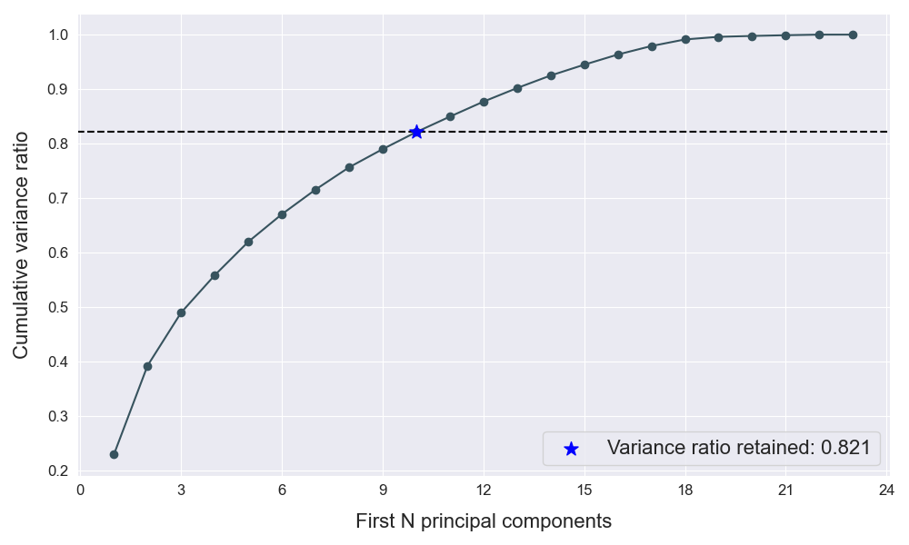
  
<table width="100%">
<tr>
<td width="15%" style="vertical-align:top; background:#F5F5F5;"><strong>Parameters:</strong></td>
<td width="75%" style="background:white;">
<strong>title: string or None, optional (default=None)</strong>
<blockquote>
Plot's title. If None, the default option is used.
</blockquote>
<strong>figsize: tuple, optional (default=(10, 6))</strong>
<blockquote>
Figure's size, format as (x, y).
</blockquote>
<strong>filename: string or None, optional (default=None)</strong>
<blockquote>
Name of the file (to save). If None, the figure is not saved.
</blockquote>
<strong>display: bool, optional (default=True)</strong>
<blockquote>
Whether to render the plot.
</blockquote>
</tr>
</table>

 

<pre><em>function</em> atom.ATOM.<strong style="color:#008AB8">plot_components</strong>(show=None,
                                   title=None,
                                   figsize=None,
                                   filename=None,
                                   display=True)

<a href="https://github.com/tvdboom/ATOM/blob/master/atom/plots.py#L146">[source]</a>
</pre>

Plot the explained variance ratio per components. Only if a Principal Component Analysis
 was applied on the dataset through the [`feature_selection`](#atom-feature-selection) method.
 Can't be called from the model subclasses.
  

  
<table width="100%">
<tr>
<td width="15%" style="vertical-align:top; background:#F5F5F5;"><strong>Parameters:</strong></td>
<td width="75%" style="background:white;">
<strong>show: int or None, optional (default=None)</strong>
<blockquote>
Number of components to show. If None, the selected number of componenets are plotted.
</blockquote>
<strong>title: string or None, optional (default=None)</strong>
<blockquote>
Plot's title. If None, the default option is used.
</blockquote>
<strong>figsize: tuple, optional (default=None)</strong>
<blockquote>
Figure's size, format as (x, y). If None, adapts size to `show` parameter.
</blockquote>
<strong>filename: string or None, optional (default=None)</strong>
<blockquote>
Name of the file (to save). If None, the figure is not saved.
</blockquote>
<strong>display: bool, optional (default=True)</strong>
<blockquote>
Whether to render the plot.
</blockquote>
</tr>
</table>

 

<pre><em>function</em> atom.ATOM.<strong style="color:#008AB8">plot_rfecv</strong>(title=None,
                              figsize=(10, 6),
                              filename=None,
                              display=True)

<a href="https://github.com/tvdboom/ATOM/blob/master/atom/plots.py#L213">[source]</a>
</pre>

Plot the scores obtained by the estimator fitted on every subset of
 the data. Only if RFECV was applied on the dataset through the
 [`feature_selection`](#atom-feature-selection) method. Can't be called from
 the model subclasses.
  
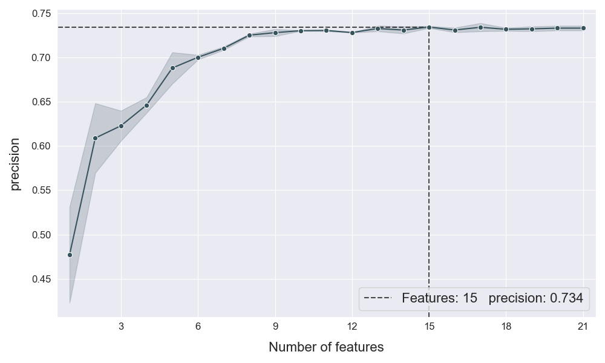
  
<table width="100%">
<tr>
<td width="15%" style="vertical-align:top; background:#F5F5F5;"><strong>Parameters:</strong></td>
<td width="75%" style="background:white;">
<strong>title: string or None, optional (default=None)</strong>
<blockquote>
Plot's title. If None, the default option is used.
</blockquote>
<strong>figsize: tuple, optional (default=(10, 6))</strong>
<blockquote>
Figure's size, format as (x, y).
</blockquote>
<strong>filename: string or None, optional (default=None)</strong>
<blockquote>
Name of the file (to save). If None, the figure is not saved.
</blockquote>
<strong>display: bool, optional (default=True)</strong>
<blockquote>
Whether to render the plot.
</blockquote>
</tr>
</table>

 

<pre><em>function</em> atom.ATOM.<strong style="color:#008AB8">plot_bagging</strong>(models=None,
                                title=None,
                                figsize=None,
                                filename=None,
                                display=True)

<a href="https://github.com/tvdboom/ATOM/blob/master/atom/plots.py#L273">[source]</a>
</pre>

Plot a boxplot of the bagging's results. Only available if the models were
 fitted using bagging>0.
  

  
<table width="100%">
<tr>
<td width="15%" style="vertical-align:top; background:#F5F5F5;"><strong>Parameters:</strong></td>
<td width="75%" style="background:white;">
<strong>models: string, sequence or None, optional (default=None)</strong>
<blockquote>
Name of the models to plot. If None, all the models in the pipeline are selected.
</blockquote>
<strong>title: string or None, optional (default=None)</strong>
<blockquote>
Plot's title. If None, the default option is used.
</blockquote>
<strong>figsize: tuple, optional (default=None)</strong>
<blockquote>
Figure's size, format as (x, y). If None, adapts size the to number of models.
</blockquote>
<strong>filename: string or None, optional (default=None)</strong>
<blockquote>
Name of the file (to save). If None, the figure is not saved.
</blockquote>
<strong>display: bool, optional (default=True)</strong>
<blockquote>
Whether to render the plot.
</blockquote>
</tr>
</table>

 

<pre><em>function</em> atom.ATOM.<strong style="color:#008AB8">plot_successive_halving</strong>(models=None,
                                           title=None,
                                           figsize=(10, 6),
                                           filename=None,
                                           display=True)

<a href="https://github.com/tvdboom/ATOM/blob/master/atom/plots.py#L336">[source]</a>
</pre>

Plot of the models' scores per iteration of the successive halving. Only
 available if the models were fitted via successive_halving.
  
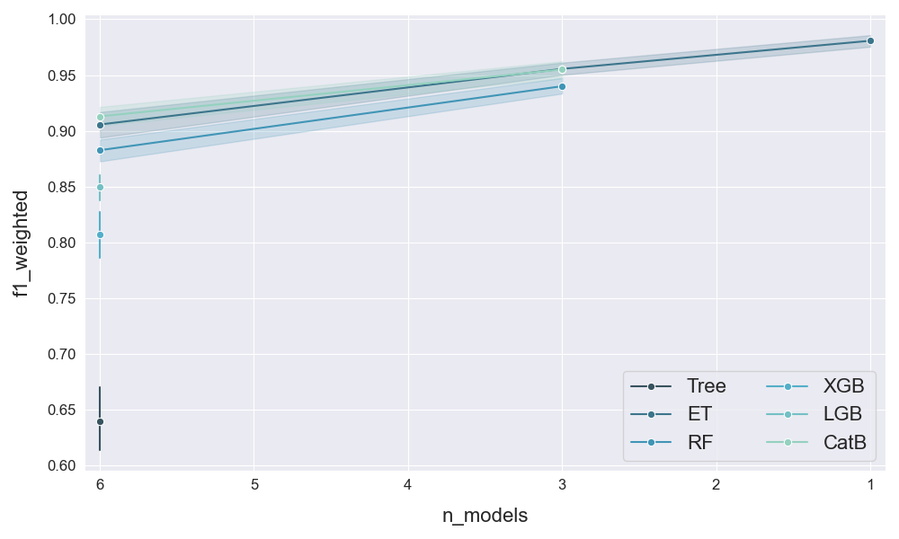
  
<table width="100%">
<tr>
<td width="15%" style="vertical-align:top; background:#F5F5F5;"><strong>Parameters:</strong></td>
<td width="75%" style="background:white;">
<strong>models: string, sequence or None, optional (default=None)</strong>
<blockquote>
Name of the models to plot. If None, all the models in the pipeline are selected.
</blockquote>
<strong>title: string or None, optional (default=None)</strong>
<blockquote>
Plot's title. If None, the default option is used.
</blockquote>
<strong>figsize: tuple, optional (default=(10, 6))</strong>
<blockquote>
Figure's size, format as (x, y).
</blockquote>
<strong>filename: string or None, optional (default=None)</strong>
<blockquote>
Name of the file (to save). If None, the figure is not saved.
</blockquote>
<strong>display: bool, optional (default=True)</strong>
<blockquote>
Whether to render the plot.
</blockquote>
</tr>
</table>

 

<pre><em>function</em> atom.ATOM.<strong style="color:#008AB8">plot_learning_curve</strong>(models=None,
                                       title=None,
                                       figsize=(10, 6),
                                       filename=None,
                                       display=True)

<a href="https://github.com/tvdboom/ATOM/blob/master/atom/plots.py#L418">[source]</a>
</pre>

Plot the model's learning curve: score vs number of training samples.
 Only available if the models were fitted via train_sizing.
  
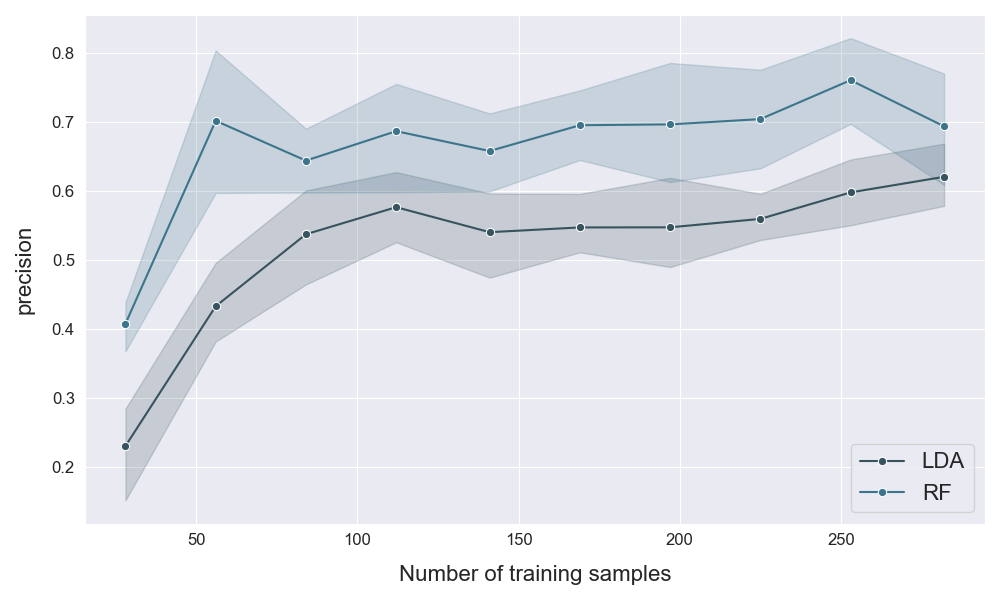
  
<table width="100%">
<tr>
<td width="15%" style="vertical-align:top; background:#F5F5F5;"><strong>Parameters:</strong></td>
<td width="75%" style="background:white;">
<strong>models: string, sequence or None, optional (default=None)</strong>
<blockquote>
Name of the models to plot. If None, all the models in the pipeline are selected.
</blockquote>
<strong>title: string or None, optional (default=None)</strong>
<blockquote>
Plot's title. If None, the default option is used.
</blockquote>
<strong>figsize: tuple, optional (default=(10, 6))</strong>
<blockquote>
Figure's size, format as (x, y).
</blockquote>
<strong>filename: string or None, optional (default=None)</strong>
<blockquote>
Name of the file (to save). If None, the figure is not saved.
</blockquote>
<strong>display: bool, optional (default=True)</strong>
<blockquote>
Whether to render the plot.
</blockquote>
</tr>
</table>

 

<pre><em>function</em> atom.ATOM.<strong style="color:#008AB8">plot_roc</strong>(models=None,
                            title=None,
                            figsize=(10, 6)),
                            filename=None,
                            display=True)

<a href="https://github.com/tvdboom/ATOM/blob/master/atom/plots.py#L499">[source]</a>
</pre>

Plot the Receiver Operating Characteristics curve. The legend shows the Area Under the ROC Curve (AUC) score.
 Only for binary classification tasks.
  

  
<table width="100%">
<tr>
<td width="15%" style="vertical-align:top; background:#F5F5F5;"><strong>Parameters:</strong></td>
<td width="75%" style="background:white;">
<strong>models: string, sequence or None, optional (default=None)</strong>
<blockquote>
Name of the models to plot. If None, all the models in the pipeline are selected.
</blockquote>
<strong>title: string or None, optional (default=None)</strong>
<blockquote>
Plot's title. If None, the default option is used.
</blockquote>
<strong>figsize: tuple, optional (default=(10, 6))</strong>
<blockquote>
Figure's size, format as (x, y).
</blockquote>
<strong>filename: string or None, optional (default=None)</strong>
<blockquote>
Name of the file (to save). If None, the figure is not saved.
</blockquote>
<strong>display: bool, optional (default=True)</strong>
<blockquote>
Whether to render the plot.
</blockquote>
</tr>
</table>

 

<pre><em>function</em> atom.ATOM.<strong style="color:#008AB8">plot_prc</strong>(models=None,
                            title=None,
                            figsize=(10, 6),
                            filename=None,
                            display=True)

<a href="https://github.com/tvdboom/ATOM/blob/master/atom/plots.py#L567">[source]</a>
</pre>

Plot the precision-recall curve. The legend shows the average precision (AP) score.
 Only for binary classification tasks.
  
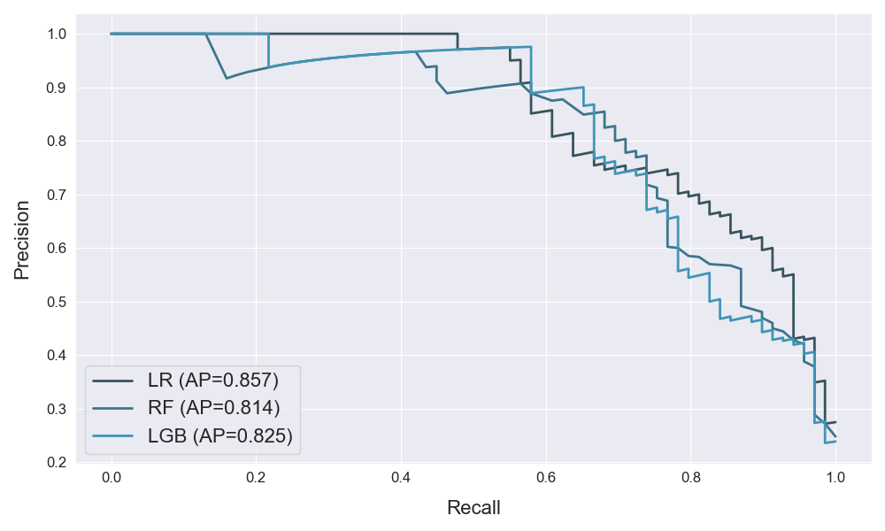
  
<table width="100%">
<tr>
<td width="15%" style="vertical-align:top; background:#F5F5F5;"><strong>Parameters:</strong></td>
<td width="75%" style="background:white;">
<strong>models: string, sequence or None, optional (default=None)</strong>
<blockquote>
Name of the models to plot. If None, all the models in the pipeline are selected.
</blockquote>
<strong>title: string or None, optional (default=None)</strong>
<blockquote>
Plot's title. If None, the default option is used.
</blockquote>
<strong>figsize: tuple, optional (default=(10, 6))</strong>
<blockquote>
Figure's size, format as (x, y).
</blockquote>
<strong>filename: string or None, optional (default=None)</strong>
<blockquote>
Name of the file (to save). If None, the figure is not saved.
</blockquote>
<strong>display: bool, optional (default=True)</strong>
<blockquote>
Whether to render the plot.
</blockquote>
</tr>
</table>

 

<pre><em>function</em> atom.ATOM.<strong style="color:#008AB8">plot_permutation_importance</strong>(models=None,
                                               show=None,
                                               n_repeats=10,
                                               title=None,
                                               figsize=None,
                                               filename=None,
                                               display=True)

<a href="https://github.com/tvdboom/ATOM/blob/master/atom/plots.py#L634">[source]</a>
</pre>

Plot the feature permutation importance of models.
  
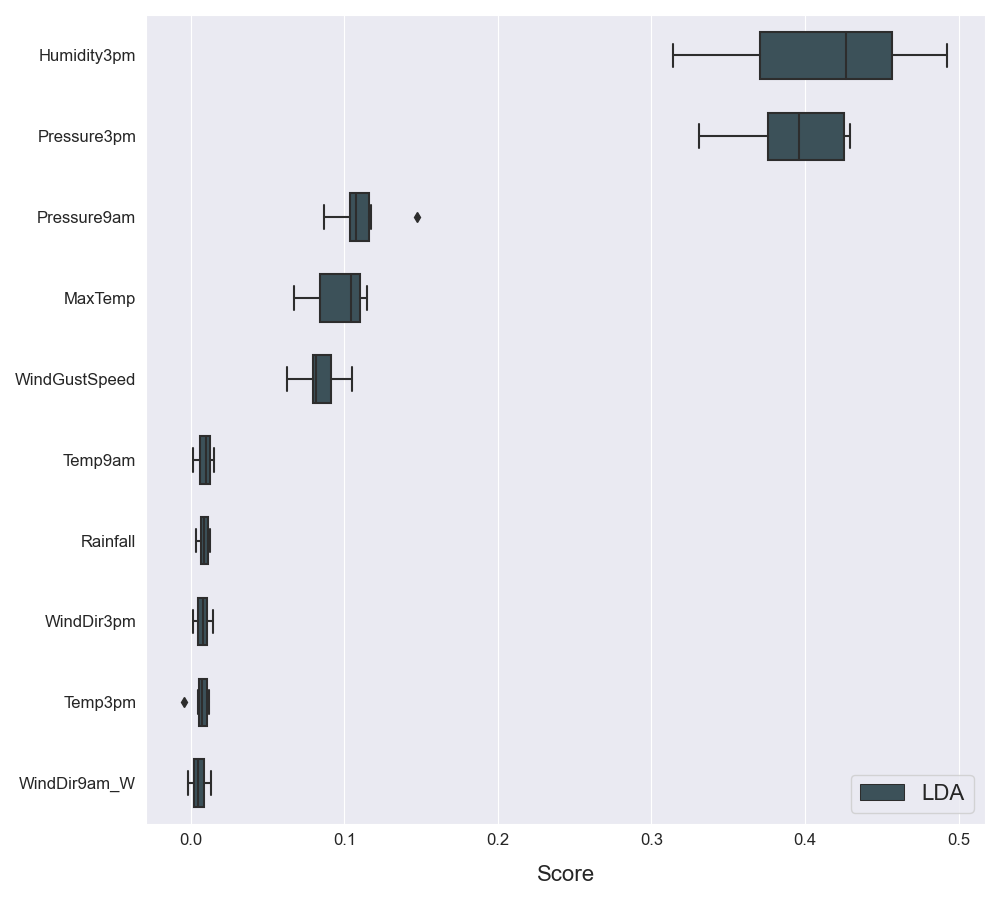
  
<table width="100%">
<tr>
<td width="15%" style="vertical-align:top; background:#F5F5F5;"><strong>Parameters:</strong></td>
<td width="75%" style="background:white;">
<strong>models: string, sequence or None, optional (default=None)</strong>
<blockquote>
Name of the models to plot. If None, all the models in the pipeline are selected.
</blockquote>
<strong>show: int, optional (default=None)</strong>
<blockquote>
Number of best features to show in the plot. None for all.
</blockquote>
<strong>n_repeats: int, optional (default=10)</strong>
<blockquote>
Number of times to permute each feature.
</blockquote>
<strong>title: string or None, optional (default=None)</strong>
<blockquote>
Plot's title. If None, the default option is used.
</blockquote>
<strong>figsize: tuple, optional (default=None)</strong>
<blockquote>
Figure's size, format as (x, y). If None, adapts size to `show` parameter.
</blockquote>
<strong>filename: string or None, optional (default=None)</strong>
<blockquote>
Name of the file (to save). If None, the figure is not saved.
</blockquote>
<strong>display: bool, optional (default=True)</strong>
<blockquote>
Whether to render the plot.
</blockquote>
</tr>
</table>

 

<pre><em>function</em> atom.ATOM.<strong style="color:#008AB8">plot_feature_importance</strong>(models=None,
                                           show=None,
                                           title=None,
                                           figsize=None,
                                           filename=None,
                                           display=True)

<a href="https://github.com/tvdboom/ATOM/blob/master/atom/plots.py#L748">[source]</a>
</pre>

Plot a tree-based model's normalized feature importance.
  

  
<table width="100%">
<tr>
<td width="15%" style="vertical-align:top; background:#F5F5F5;"><strong>Parameters:</strong></td>
<td width="75%" style="background:white;">
<strong>models: string, sequence or None, optional (default=None)</strong>
<blockquote>
Name of the models to plot. If None, all the models in the pipeline are selected.
</blockquote>
<strong>show: int, optional (default=None)</strong>
<blockquote>
Number of best features to show in the plot. None for all.
</blockquote>
<strong>title: string or None, optional (default=None)</strong>
<blockquote>
Plot's title. If None, the default option is used.
</blockquote>
<strong>figsize: tuple, optional (default=None)</strong>
<blockquote>
Figure's size, format as (x, y). If None, adapts size to `show` parameter.
</blockquote>
<strong>filename: string or None, optional (default=None)</strong>
<blockquote>
Name of the file (to save). If None, the figure is not saved.
</blockquote>
<strong>display: bool, optional (default=True)</strong>
<blockquote>
Whether to render the plot.
</blockquote>
</tr>
</table>

 

<pre><em>function</em> atom.ATOM.<strong style="color:#008AB8">plot_confusion_matrix</strong>(models=None,
                                         normalize=False,
                                         title=None,
                                         figsize=(8, 8),
                                         filename=None,
                                         display=True)

<a href="https://github.com/tvdboom/ATOM/blob/master/atom/plots.py#L838">[source]</a>
</pre>

<ul>
<li>For 1 model: plot it's confusion matrix in a heatmap.</li>
<li>For >1 models: compare TP, FP, FN and TN in a barplot. Not supported for multiclass classification.</li>
</ul>

  
<table width="100%">
<tr>
<td width="15%" style="vertical-align:top; background:#F5F5F5;"><strong>Parameters:</strong></td>
<td width="75%" style="background:white;">
<strong>models: string, sequence or None, optional (default=None)</strong>
<blockquote>
Name of the models to plot. If None, all the models in the pipeline are selected.
</blockquote>
<strong>normalize: bool, optional (default=False)</strong>
<blockquote>
Whether to normalize the matrix.
</blockquote>
<strong>title: string or None, optional (default=None)</strong>
<blockquote>
Plot's title. If None, the default option is used.
</blockquote>
<strong>figsize: tuple, optional (default=(8, 8))</strong>
<blockquote>
Figure's size, format as (x, y).
</blockquote>
<strong>filename: string or None, optional (default=None)</strong>
<blockquote>
Name of the file (to save). If None, the figure is not saved.
</blockquote>
<strong>display: bool, optional (default=True)</strong>
<blockquote>
Whether to render the plot.
</blockquote>
</tr>
</table>

 

<pre><em>function</em> atom.ATOM.<strong style="color:#008AB8">plot_threshold</strong>(models=None,
                                  metric=None,
                                  steps=100,
                                  title=None,
                                  figsize=(10, 6),
                                  filename=None,
                                  display=True)

<a href="https://github.com/tvdboom/ATOM/blob/master/atom/plots.py#L962">[source]</a>
</pre>

Plot performance metric(s) against multiple threshold values.
  
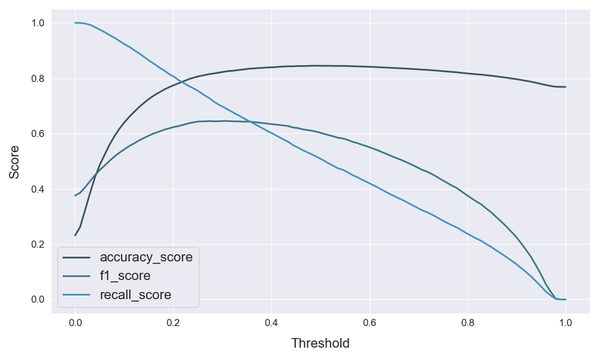
  
<table width="100%">
<tr>
<td width="15%" style="vertical-align:top; background:#F5F5F5;"><strong>Parameters:</strong></td>
<td width="75%" style="background:white;">
<strong>models: string, sequence or None, optional (default=None)</strong>
<blockquote>
Name of the models to plot. If None, all the models in the pipeline are selected.
</blockquote>
<strong>metric: string, callable, sequence or None, optional (default=None)</strong>
<blockquote>
Metric(s) to plot. These can be one of the pre-defined sklearn scorers as string,
 a metric function or a sklearn scorer object. If None, the metric used to fit
 the pipeline is used.
</blockquote>
<strong>steps: int, optional (default=100)</strong>
<blockquote>
Number of thresholds measured.
</blockquote>
<strong>title: string or None, optional (default=None)</strong>
<blockquote>
Plot's title. If None, the default option is used.
</blockquote>
<strong>figsize: tuple, optional (default=(10, 6))</strong>
<blockquote>
Figure's size, format as (x, y).
</blockquote>
<strong>filename: string or None, optional (default=None)</strong>
<blockquote>
Name of the file (to save). If None, the figure is not saved.
</blockquote>
<strong>display: bool, optional (default=True)</strong>
<blockquote>
Whether to render the plot.
</blockquote>
</tr>
</table>

 

<pre><em>function</em> atom.ATOM.<strong style="color:#008AB8">plot_probabilities</strong>(models=None,
                                      target=1,
                                      title=None,
                                      figsize=(10, 6),
                                      filename=None,
                                      display=True)

<a href="https://github.com/tvdboom/ATOM/blob/master/atom/plots.py#L1058">[source]</a>
</pre>

Plot a function of the probability of the classes of being the target class.
  
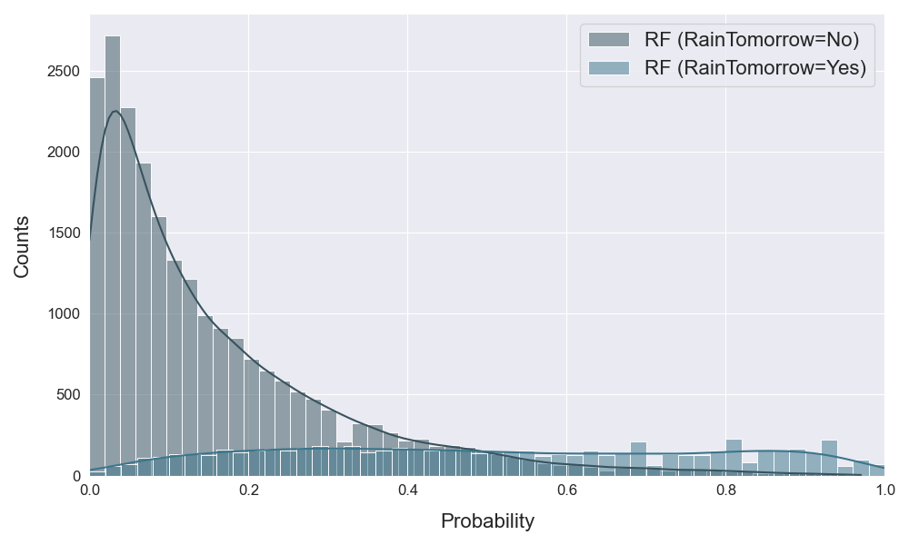
  
<table width="100%">
<tr>
<td width="15%" style="vertical-align:top; background:#F5F5F5;"><strong>Parameters:</strong></td>
<td width="75%" style="background:white;">
<strong>models: string, sequence or None, optional (default=None)</strong>
<blockquote>
Name of the models to plot. If None, all the models in the pipeline are selected.
</blockquote>
<strong>target: int or string, optional (default=1)</strong>
<blockquote>
Probability of being that class (as index or name).
</blockquote>
<strong>title: string or None, optional (default=None)</strong>
<blockquote>
Plot's title. If None, the default option is used.
</blockquote>
<strong>figsize: tuple, optional (default=(10, 6))</strong>
<blockquote>
Figure's size, format as (x, y).
</blockquote>
<strong>filename: string or None, optional (default=None)</strong>
<blockquote>
Name of the file (to save). If None, the figure is not saved.
</blockquote>
<strong>display: bool, optional (default=True)</strong>
<blockquote>
Whether to render the plot.
</blockquote>
</tr>
</table>

 

<pre><em>function</em> atom.ATOM.<strong style="color:#008AB8">plot_calibration</strong>(models=None,
                                    n_bins=10,
                                    title=None,
                                    figsize=(10, 10),
                                    filename=None,
                                    display=True)

<a href="https://github.com/tvdboom/ATOM/blob/master/atom/plots.py#L1143">[source]</a>
</pre>

Plot the calibration curve for a binary classifier.

 Well calibrated classifiers are probabilistic classifiers for which the
 output of the predict_proba method can be directly interpreted as a
 confidence level. For instance a well calibrated (binary) classifier
 should classify the samples such that among the samples to which it gave
 a predict_proba value close to 0.8, approx. 80% actually belong to the
 positive class. This figure shows two plots: the calibration curve and a
 distribution of all predicted probabilities of the classifier.
 Code snippets from [https://scikit-learn.org/stable/auto_examples/
calibration/plot_calibration_curve.html](https://scikit-learn.org/stable/auto_examples/
calibration/plot_calibration_curve.html).
  
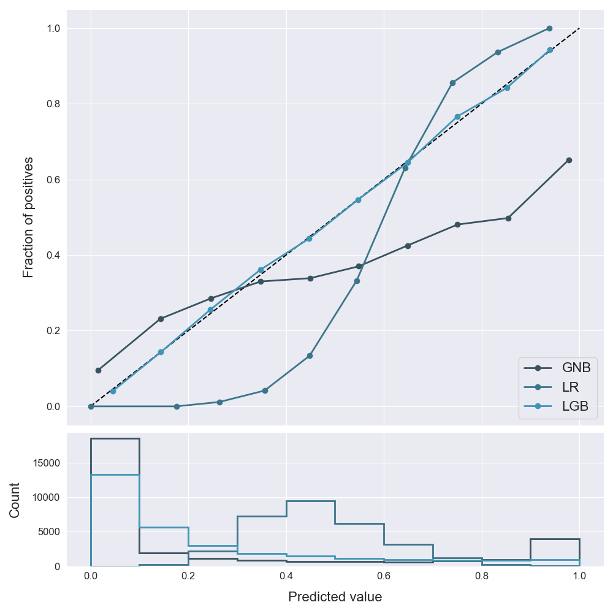
  
<table width="100%">
<tr>
<td width="15%" style="vertical-align:top; background:#F5F5F5;"><strong>Parameters:</strong></td>
<td width="75%" style="background:white;">
<strong>models: string, sequence or None, optional (default=None)</strong>
<blockquote>
Name of the models to plot. If None, all the models in the pipeline are selected.
</blockquote>
<strong>n_bins: int, optional (default=10)</strong>
<blockquote>
Number of bins for the calibration calculation and the histogram.
 Minimum of 5 required.
</blockquote>
<strong>title: string or None, optional (default=None)</strong>
<blockquote>
Plot's title. If None, the default option is used.
</blockquote>
<strong>figsize: tuple, optional (default=(10, 10))</strong>
<blockquote>
Figure's size, format as (x, y).
</blockquote>
<strong>filename: string or None, optional (default=None)</strong>
<blockquote>
Name of the file (to save). If None, the figure is not saved.
</blockquote>
<strong>display: bool, optional (default=True)</strong>
<blockquote>
Whether to render the plot.
</blockquote>
</tr>
</table>

 

<pre><em>function</em> atom.ATOM.<strong style="color:#008AB8">plot_gains</strong>(models=None,
                              title=None,
                              figsize=(10, 6),
                              filename=None,
                              display=True)

<a href="https://github.com/tvdboom/ATOM/blob/master/atom/plots.py#L1248">[source]</a>
</pre>

Plot the cumulative gains curve. Only for binary classification.
  
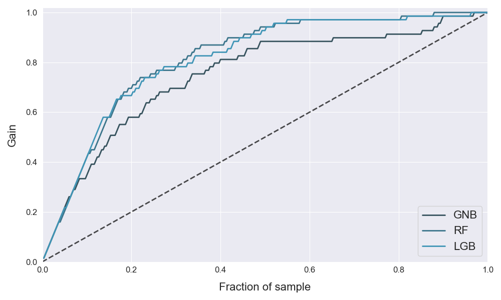
  
<table width="100%">
<tr>
<td width="15%" style="vertical-align:top; background:#F5F5F5;"><strong>Parameters:</strong></td>
<td width="75%" style="background:white;">
<strong>models: string, sequence or None, optional (default=None)</strong>
<blockquote>
Name of the models to plot. If None, all the models in the pipeline are selected.
</blockquote>
<strong>title: string or None, optional (default=None)</strong>
<blockquote>
Plot's title. If None, the default option is used.
</blockquote>
<strong>figsize: tuple, optional (default=(10, 6))</strong>
<blockquote>
Figure's size, format as (x, y).
</blockquote>
<strong>filename: string or None, optional (default=None)</strong>
<blockquote>
Name of the file (to save). If None, the figure is not saved.
</blockquote>
<strong>display: bool, optional (default=True)</strong>
<blockquote>
Whether to render the plot.
</blockquote>
</tr>
</table>

 

<pre><em>function</em> atom.ATOM.<strong style="color:#008AB8">plot_lift</strong>(models=None,
                             title=None,
                             figsize=(10, 6),
                             filename=None,
                             display=True)

<a href="https://github.com/tvdboom/ATOM/blob/master/atom/plots.py#L1323">[source]</a>
</pre>

Plot the lift curve. Only for binary classification.
  

  
<table width="100%">
<tr>
<td width="15%" style="vertical-align:top; background:#F5F5F5;"><strong>Parameters:</strong></td>
<td width="75%" style="background:white;">
<strong>models: string, sequence or None, optional (default=None)</strong>
<blockquote>
Name of the models to plot. If None, all the models in the pipeline are selected.
</blockquote>
<strong>title: string or None, optional (default=None)</strong>
<blockquote>
Plot's title. If None, the default option is used.
</blockquote>
<strong>figsize: tuple, optional (default=(10, 6))</strong>
<blockquote>
Figure's size, format as (x, y).
</blockquote>
<strong>filename: string or None, optional (default=None)</strong>
<blockquote>
Name of the file (to save). If None, the figure is not saved.
</blockquote>
<strong>display: bool, optional (default=True)</strong>
<blockquote>
Whether to render the plot.
</blockquote>
</tr>
</table>

 

<pre><em>function</em> atom.ATOM.<strong style="color:#008AB8">plot_bo</strong>(models=None,
                           title=None,
                           figsize=(10, 6),
                           filename=None,
                           display=True)

<a href="https://github.com/tvdboom/ATOM/blob/master/atom/plots.py#L1323">[source]</a>
</pre>

Plot the bayesian optimization scoring. Only for models that ran the hyperparameter
 optimization. This is the same plot as the one produced by `plot_bo=True` while
 running the BO.
  
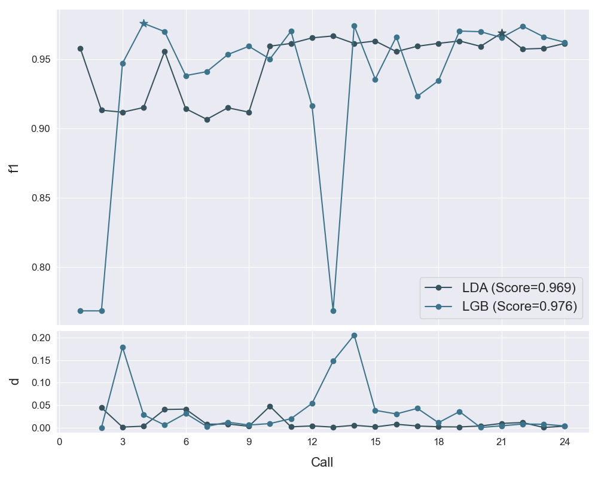
  
<table width="100%">
<tr>
<td width="15%" style="vertical-align:top; background:#F5F5F5;"><strong>Parameters:</strong></td>
<td width="75%" style="background:white;">
<strong>models: string, sequence or None, optional (default=None)</strong>
<blockquote>
Name of the models to plot. If None, all the models in the pipeline are selected.
</blockquote>
<strong>title: string or None, optional (default=None)</strong>
<blockquote>
Plot's title. If None, the default option is used.
</blockquote>
<strong>figsize: tuple, optional (default=(10, 6))</strong>
<blockquote>
Figure's size, format as (x, y).
</blockquote>
<strong>filename: string or None, optional (default=None)</strong>
<blockquote>
Name of the file (to save). If None, the figure is not saved.
</blockquote>
<strong>display: bool, optional (default=True)</strong>
<blockquote>
Whether to render the plot.
</blockquote>
</tr>
</table>

 

### Plot customization

The plotting aesthetics can be customized with the use of the `@classmethods` described hereunder, e.g. `ATOMClassifier.set_style('white')`.

<table width="100%">
<tr>
<td width="15%"><a href="#atom-set-style">set_style</a></td>
<td>Change the seaborn plotting style.</td>
</tr>

<tr>
<td width="15%"><a href="#atom-set-palette">set_palette</a></td>
<td>Change the seaborn color palette.</td>
</tr>

<tr>
<td width="15%"><a href="#atom-set-title-fontsize">set_title_fontsize</a></td>
<td>Change the fontsize of the plot's title.</td>
</tr>

<tr>
<td width="15%"><a href="#atom-set-label-fontsize">set_label_fontsize</a></td>
<td>Change the fontsize of the plot's labels and legends.</td>
</tr>

<tr>
<td width="15%"><a href="#atom-set-tick-fontsize">set_tick_fontsize</a></td>
<td>Change the fontsize of the plot's ticks.</td>
</tr>
</table>
 

<pre><em>classmethod</em> ATOM.<strong style="color:#008AB8">set_style</strong>(style='darkgrid')

<a href="https://github.com/tvdboom/ATOM/blob/master/atom/atom.py#L2435">[source]</a>
</pre>

Change the plotting style. See the seaborn [documentation](https://seaborn.pydata.org/tutorial/aesthetics.html#seaborn-figure-styles).
  
<table width="100%">
<tr>
<td width="15%" style="vertical-align:top; background:#F5F5F5;"><strong>Parameters:</strong></td>
<td width="75%" style="background:white;">
<strong>style: string, optional (default='darkgrid')</strong>
<blockquote>
Style to change to. Available options are: 'darkgrid', 'whitegrid', 'dark', 'white', and 'ticks'.
</blockquote>
</tr>
</table>

 

<pre><em>classmethod</em> ATOM.<strong style="color:#008AB8">set_palette</strong>(palette='GnBu_d')

<a href="https://github.com/tvdboom/ATOM/blob/master/atom/atom.py#L2450">[source]</a>
</pre>

Change the plotting palette. See the seaborn [documentation](https://seaborn.pydata.org/tutorial/color_palettes.html)
 for the available options.
  
<table width="100%">
<tr>
<td width="15%" style="vertical-align:top; background:#F5F5F5;"><strong>Parameters:</strong></td>
<td width="75%" style="background:white;">
<strong>palette: string, optional (default='GnBu_d')</strong>
<blockquote>
Palette to change to.
</blockquote>
</tr>
</table>

 

<pre><em>classmethod</em> ATOM.<strong style="color:#008AB8">set_title_fontsize</strong>(fontsize=20)

<a href="https://github.com/tvdboom/ATOM/blob/master/atom/atom.py#L2465">[source]</a>
</pre>

Change the fontsize of the plot's title.
  
<table width="100%">
<tr>
<td width="15%" style="vertical-align:top; background:#F5F5F5;"><strong>Parameters:</strong></td>
<td width="75%" style="background:white;">
<strong>fontsize: int, optional (default=20)</strong>
<blockquote>
Fontsize to change to.
</blockquote>
</tr>
</table>

 

<pre><em>classmethod</em> ATOM.<strong style="color:#008AB8">set_label_fontsize</strong>(fontsize=16)

<a href="https://github.com/tvdboom/ATOM/blob/master/atom/atom.py#L2477">[source]</a>
</pre>

Change the fontsize of the plot's labels and legends.
  
<table width="100%">
<tr>
<td width="15%" style="vertical-align:top; background:#F5F5F5;"><strong>Parameters:</strong></td>
<td width="75%" style="background:white;">
<strong>fontsize: int, optional (default=16)</strong>
<blockquote>
Fontsize to change to.
</blockquote>
</tr>
</table>

 

<pre><em>classmethod</em> ATOM.<strong style="color:#008AB8">set_tick_fontsize</strong>(fontsize=12)

<a href="https://github.com/tvdboom/ATOM/blob/master/atom/atom.py#L2489">[source]</a>
</pre>

Change the fontsize of the plot's ticks.
  
<table width="100%">
<tr>
<td width="15%" style="vertical-align:top; background:#F5F5F5;"><strong>Parameters:</strong></td>
<td width="75%" style="background:white;">
<strong>fontsize: int, optional (default=12)</strong>
<blockquote>
Fontsize to change to.
</blockquote>
</tr>
</table>

 
