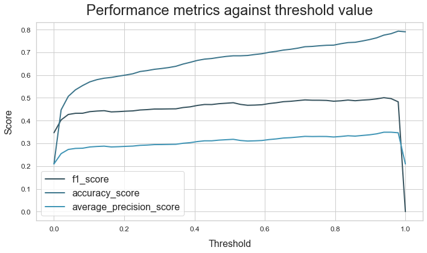
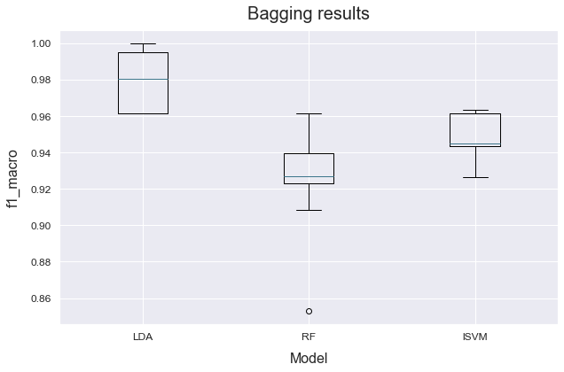
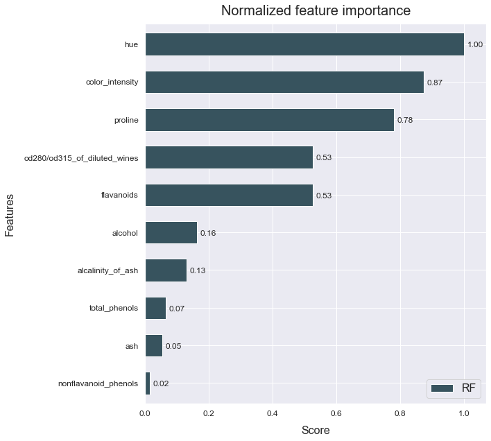

# Binary classification
---------------------------------

Download the Australian weather dataset from [https://www.kaggle.com/jsphyg/weather-dataset-rattle-package](https://www.kaggle.com/jsphyg/weather-dataset-rattle-package).
 This dataset tries to predict whether or not it will rain tomorrow by
 training a classification model on target `RainTomorrow`.

**Load the data**


```python
# Import packages
import numpy as np
import pandas as pd
from sklearn.metrics import fbeta_score
from atom import ATOMClassifier

# Load the Australian weather dataset
X = pd.read_csv('../weatherAUS.csv')
X = X.drop(['RISK_MM', 'Date'], axis=1)  # Drop unrelated features
```

**Run the pipeline**


```python
# Call ATOM using only a percentage of the complete dataset (for explanatory purposes)
atom = ATOMClassifier(X, y="RainTomorrow", percentage=5, log='auto', n_jobs=2, verbose=3)
```

    <<=============== ATOM ===============>>
    Parallel processing with 2 cores.
    Initial data cleaning...
     --> Dropping 45 duplicate rows.
    Algorithm task: binary classification.
    
    Dataset stats ===================>
    Shape: (7107, 22)
    Missing values: 15680
    Categorical columns: 5
    Scaled: False
    ----------------------------------
    Size of training set: 4974
    Size of test set: 2133
    ----------------------------------
    Class balance: No:Yes <==> 3.4:1.0
    Instances in RainTomorrow per class:
    |        |    total |    train_set |    test_set |
    |:-------|---------:|-------------:|------------:|
    | 0: No  |     5502 |         3854 |        1648 |
    | 1: Yes |     1605 |         1120 |         485 |
    
    


```python
# If we change a column during the pre-processing,
# we need to call the update method to update all data attributes

atom.X['MaxTemp'] = np.log(atom.X['MaxTemp'])

# MaxTemp has now been changed for atom.X, but not in atom.X_train, atom.dataset, etc...
# To do so, we use the update method...
atom.update('X')

assert atom.X['MaxTemp'].equals(atom.dataset['MaxTemp'])
```


```python
# Impute missing values
atom.impute(strat_num='knn', strat_cat='remove', max_frac_rows=0.8)
```

    Imputing missing values...
     --> Removing 741 rows for containing too many missing values.
     --> Imputing 3 missing values using the KNN imputer in feature MinTemp.
     --> Imputing 4 missing values using the KNN imputer in feature MaxTemp.
     --> Imputing 43 missing values using the KNN imputer in feature Rainfall.
     --> Imputing 2315 missing values using the KNN imputer in feature Evaporation.
     --> Imputing 2661 missing values using the KNN imputer in feature Sunshine.
     --> Removing 222 rows due to missing values in feature WindGustDir.
     --> Imputing 221 missing values using the KNN imputer in feature WindGustSpeed.
     --> Removing 327 rows due to missing values in feature WindDir9am.
     --> Removing 24 rows due to missing values in feature WindDir3pm.
     --> Imputing 6 missing values using the KNN imputer in feature WindSpeed9am.
     --> Imputing 2 missing values using the KNN imputer in feature WindSpeed3pm.
     --> Imputing 25 missing values using the KNN imputer in feature Humidity9am.
     --> Imputing 55 missing values using the KNN imputer in feature Humidity3pm.
     --> Imputing 56 missing values using the KNN imputer in feature Pressure9am.
     --> Imputing 51 missing values using the KNN imputer in feature Pressure3pm.
     --> Imputing 2118 missing values using the KNN imputer in feature Cloud9am.
     --> Imputing 2253 missing values using the KNN imputer in feature Cloud3pm.
     --> Imputing 5 missing values using the KNN imputer in feature Temp9am.
     --> Imputing 32 missing values using the KNN imputer in feature Temp3pm.
     --> Removing 43 rows due to missing values in feature RainToday.
    


```python
# Encode the categorical features
atom.encode(max_onehot=10, frac_to_other=0.04)
```

    Encoding categorical features...
     --> Target-encoding feature Location.  Contains 1 unique categories.
     --> Target-encoding feature WindGustDir.  Contains 16 unique categories.
     --> Target-encoding feature WindDir9am.  Contains 16 unique categories.
     --> Target-encoding feature WindDir3pm.  Contains 16 unique categories.
     --> Label-encoding feature RainToday. Contains 2 unique categories.
    


```python
# Perform undersampling of the majority class to balance the dataset
atom.balance(undersample=0.8)
```

    Performing undersampling...
     --> Removing 249 rows from class No.
    


```python
# Remove outliers from the training set
atom.outliers(max_sigma=5)
```

    Handling outliers...
     --> Dropping 18 rows due to outliers.
    


```python
# Select only the best 10 features
atom.feature_selection(strategy="univariate", max_features=15, max_correlation=0.8)

# See which features were removed due to collinearity
atom.collinear
```

    Performing feature selection...
     --> Feature Location was removed due to low variance: 0.00.
     --> Feature Pressure3pm was removed due to collinearity with another feature.
     --> Feature Temp9am was removed due to collinearity with another feature.
     --> Feature Temp3pm was removed due to collinearity with another feature.
     --> Feature MinTemp was removed after the univariate test (score: 9.36  p-value: 0.00).
     --> Feature Evaporation was removed after the univariate test (score: 27.00  p-value: 0.00).
    


<div>
<style scoped>
    .dataframe tbody tr th:only-of-type {
        vertical-align: middle;
    }

    .dataframe tbody tr th {
        vertical-align: top;
    }

    .dataframe thead th {
        text-align: right;
    }
</style>
<table border="1" class="dataframe">
  <thead>
    <tr style="text-align: right;">
      <th></th>
      <th>drop_feature</th>
      <th>correlated_feature</th>
      <th>correlation_value</th>
    </tr>
  </thead>
  <tbody>
    <tr>
      <th>0</th>
      <td>Pressure3pm</td>
      <td>Pressure9am</td>
      <td>0.95413</td>
    </tr>
    <tr>
      <th>1</th>
      <td>Temp9am</td>
      <td>MinTemp, MaxTemp</td>
      <td>0.9201, 0.89643</td>
    </tr>
    <tr>
      <th>2</th>
      <td>Temp3pm</td>
      <td>MaxTemp, Temp9am</td>
      <td>0.9587, 0.87527</td>
    </tr>
  </tbody>
</table>
</div>


```python
# Change the verbosity of ATOM to not print too much details while fitting
atom.verbose = 2

# Let's use a custom metric
def f2_score(y_true, y_pred):
    return fbeta_score(y_true, y_pred, beta=2)

# Let's compare the performance of various gradient boosting algorithms
atom.pipeline(['gbm', 'lgb', 'catb'],
              metric=f2_score,
              max_iter=5,
              init_points=5,
              cv=1,
              bagging=5)
```

    
    Running pipeline =================>
    Models in pipeline: GBM, LGB, CatB
    Metric: f2_score
    
    
    Running BO for Gradient Boosting Machine...
    Final results for Gradient Boosting Machine:         
    Bayesian Optimization ---------------------------
    Best hyperparameters: {'n_estimators': 414, 'learning_rate': 1.0, 'subsample': 0.5, 'max_depth': 2, 'max_features': 0.8, 'criterion': 'mse', 'min_samples_split': 12, 'min_samples_leaf': 1, 'ccp_alpha': 0.0}
    Best score on the BO: 0.7485
    Time elapsed: 37.958s
    Fitting -----------------------------------------
    Score on the training set: 0.8465
    Score on the test set: 0.5824
    Time elapsed: 0.796s
    Bagging -----------------------------------------
    Mean: 0.5587   Std: 0.0105
    Time elapsed: 3.562s
    -------------------------------------------------
    Total time: 42.316s
    
    
    Running BO for LightGBM...
    Final results for LightGBM:         
    Bayesian Optimization ---------------------------
    Best hyperparameters: {'n_estimators': 345, 'learning_rate': 0.6, 'max_depth': 3, 'num_leaves': 24, 'min_child_weight': 9, 'min_child_samples': 17, 'subsample': 0.5, 'colsample_bytree': 0.5, 'reg_alpha': 0.0, 'reg_lambda': 0.1}
    Best score on the BO: 0.7583
    Time elapsed: 3.261s
    Fitting -----------------------------------------
    Score on the training set: 0.9937
    Score on the test set: 0.6182
    Time elapsed: 0.187s
    Bagging -----------------------------------------
    Mean: 0.6169   Std: 0.0197
    Time elapsed: 0.370s
    -------------------------------------------------
    Total time: 3.819s
    
    
    Running BO for CatBoost...
    Final results for CatBoost:         
    Bayesian Optimization ---------------------------
    Best hyperparameters: {'n_estimators': 499, 'learning_rate': 0.09, 'max_depth': 9, 'subsample': 0.7, 'colsample_bylevel': 0.8, 'reg_lambda': 100.0}
    Best score on the BO: 0.7714
    Time elapsed: 14.712s
    Fitting -----------------------------------------
    Score on the training set: 0.9390
    Score on the test set: 0.6365
    Time elapsed: 3.890s
    Bagging -----------------------------------------
    Mean: 0.6374   Std: 0.0083
    Time elapsed: 19.245s
    -------------------------------------------------
    Total time: 37.847s
    
    
    Final results ================>>
    Duration: 1m:23s
    Metric: f2_score
    --------------------------------
    Gradient Boosting Machine --> 0.559 ± 0.010 ~
    LightGBM                  --> 0.617 ± 0.020 ~
    CatBoost                  --> 0.637 ± 0.008 !! ~
    

**Analyze the results**


```python
# Let's have a look at the best model
print('And the winner is...', atom.winner.longname)

print('Score on the training set: ', atom.winner.score_train)
print('Score on the test set: ', atom.winner.score_test)
```

    And the winner is... CatBoost
    Score on the training set:  0.9390495867768595
    Score on the test set:  0.6364787840405319
    


```python
# Make some plots to analyze the results
atom.winner.plot_confusion_matrix(normalize=True, figsize=(7, 7), filename='confusion_matrix.png')
atom.winner.plot_probabilities()

# Change plots aesthetics
ATOMClassifier.set_style('whitegrid')
ATOMClassifier.set_title_fontsize(24)

atom.plot_ROC(models=('LGB', 'CatB'), title="ROC for the LightGBM vs CatBoost model")
atom.plot_PRC(title="PRC comparison of the models")
atom.catb.plot_threshold(metric=['f1', 'accuracy', 'average_precision'], steps=50, filename='thresholds.png')
```





<br><br>

# Multiclass classification
---------------------------------

Import the wine dataset from [sklearn.datasets](https://scikit-learn.org/stable/datasets/index.html#wine-dataset).
 This is a small and easy to train dataset which goal is to classify wines
 into three groups (which cultivator it's from) using features based on the results
 of chemical analysis.


**Load the data**

```python
# Import packages
import numpy as np
import pandas as pd
from sklearn.datasets load_wine
from atom.atom import ATOMClassifier

# Load the dataset's features and targets
dataset = load_wine()

# Convert to pd.DtaFrame to get the names of the features
data = np.c_[dataset.data, dataset.target]
columns = np.append(dataset.feature_names, ["target"])
data = pd.DataFrame(data, columns=columns)
X = data.drop('target', axis=1)
y = data['target']
```

**Run the pipeline**


```python
# Call ATOMclass for ML task exploration
atom = ATOMClassifier(X, y, n_jobs=-1, verbose=3)

# Fit the pipeline with the selected models
atom.pipeline(models=['LDA','RF', 'lSVM'],
              metric='f1_macro',
              max_iter=4,
              init_points=3,
              cv=3,
              bagging=10)
```

    <<=============== ATOM ===============>>
    Parallel processing with 4 cores.
    Initial data cleaning...
    Algorithm task: multiclass classification. Number of classes: 3.
    
    Dataset stats ===================>
    Shape: (178, 14)
    Scaled: False
    ----------------------------------
    Size of training set: 124
    Size of test set: 54
    ----------------------------------
    Instances in target per class:
    |    |    total |    train_set |    test_set |
    |---:|---------:|-------------:|------------:|
    |  0 |       59 |           42 |          17 |
    |  1 |       71 |           47 |          24 |
    |  2 |       48 |           35 |          13 |
    
    
    Running pipeline =================>
    Models in pipeline: LDA, RF, lSVM
    Metric: f1_macro
    
    
    Running BO for Linear Discriminant Analysis...
    Initial point: 1 --------------------------------
    Parameters --> {'solver': 'lsqr', 'shrinkage': 0.9}
    Evaluation --> f1_macro: 0.6787
    Time elapsed: 0.815s   Total time: 0.816s
    Initial point: 2 --------------------------------
    Parameters --> {'solver': 'lsqr', 'shrinkage': 0.8}
    Evaluation --> f1_macro: 0.6865
    Time elapsed: 0.505s   Total time: 1.320s
    Initial point: 3 --------------------------------
    Parameters --> {'solver': 'eigen', 'shrinkage': 0.7}
    Evaluation --> f1_macro: 0.6667
    Time elapsed: 0.021s   Total time: 1.341s
    Iteration: 1 ------------------------------------
    Parameters --> {'solver': 'svd'}
    Evaluation --> f1_macro: 0.9753
    Time elapsed: 0.020s   Total time: 1.560s
    Iteration: 2 ------------------------------------
    Parameters --> {'solver': 'svd'}
    Evaluation --> f1_macro: 0.9753
    Time elapsed: 0.026s   Total time: 1.796s
    
    Final results for Linear Discriminant Analysis:         
    Bayesian Optimization ---------------------------
    Best hyperparameters: {'solver': 'svd'}
    Best score on the BO: 0.9753
    Time elapsed: 1.936s
    Fitting -----------------------------------------
    Score on the training set: 1.0000
    Score on the test set: 0.9617
    Time elapsed: 0.079s
    Bagging -----------------------------------------
    Mean: 0.9788   Std: 0.0159
    Time elapsed: 0.035s
    -------------------------------------------------
    Total time: 2.050s
    
    
    Running BO for Random Forest...
    Initial point: 1 --------------------------------
    Parameters --> {'n_estimators': 460, 'max_depth': 5, 'max_features': 0.9, 'criterion': 'entropy', 'min_samples_split': 10, 'min_samples_leaf': 20, 'ccp_alpha': 0.03, 'bootstrap': True, 'max_samples': 0.7}
    Evaluation --> f1_macro: 0.8673
    Time elapsed: 0.835s   Total time: 0.836s
    Initial point: 2 --------------------------------
    Parameters --> {'n_estimators': 210, 'max_depth': 6, 'max_features': 0.5, 'criterion': 'entropy', 'min_samples_split': 11, 'min_samples_leaf': 14, 'ccp_alpha': 0.025, 'bootstrap': False}
    Evaluation --> f1_macro: 0.9357
    Time elapsed: 0.449s   Total time: 1.286s
    Initial point: 3 --------------------------------
    Parameters --> {'n_estimators': 155, 'max_depth': 7, 'max_features': 0.7, 'criterion': 'entropy', 'min_samples_split': 18, 'min_samples_leaf': 13, 'ccp_alpha': 0.02, 'bootstrap': False}
    Evaluation --> f1_macro: 0.8638
    Time elapsed: 0.405s   Total time: 1.691s
    Iteration: 1 ------------------------------------
    Parameters --> {'n_estimators': 460, 'max_depth': 6, 'max_features': 0.9, 'criterion': 'entropy', 'min_samples_split': 10, 'min_samples_leaf': 20, 'ccp_alpha': 0.035, 'bootstrap': True, 'max_samples': 0.7}
    Evaluation --> f1_macro: 0.9073
    Time elapsed: 0.827s   Total time: 2.801s
    Iteration: 2 ------------------------------------
    Parameters --> {'n_estimators': 20, 'max_depth': 3, 'max_features': 0.7, 'criterion': 'gini', 'min_samples_split': 3, 'min_samples_leaf': 18, 'ccp_alpha': 0.015, 'bootstrap': False}
    Evaluation --> f1_macro: 0.8953
    Time elapsed: 0.234s   Total time: 3.362s
    Iteration: 3 ------------------------------------
    Parameters --> {'n_estimators': 20, 'max_depth': 8, 'max_features': 0.6, 'criterion': 'entropy', 'min_samples_split': 14, 'min_samples_leaf': 3, 'ccp_alpha': 0.03, 'bootstrap': True, 'max_samples': 0.6}
    Evaluation --> f1_macro: 0.9512
    Time elapsed: 0.231s   Total time: 3.822s
    Iteration: 4 ------------------------------------
    Parameters --> {'n_estimators': 20, 'max_depth': 9, 'max_features': 1.0, 'criterion': 'entropy', 'min_samples_split': 20, 'min_samples_leaf': 7, 'ccp_alpha': 0.02, 'bootstrap': False}
    Evaluation --> f1_macro: 0.8560
    Time elapsed: 0.235s   Total time: 4.563s
    
    Final results for Random Forest:         
    Bayesian Optimization ---------------------------
    Best hyperparameters: {'n_estimators': 20, 'max_depth': 8, 'max_features': 0.6, 'criterion': 'entropy', 'min_samples_split': 14, 'min_samples_leaf': 3, 'ccp_alpha': 0.03, 'bootstrap': True, 'max_samples': 0.6}
    Best score on the BO: 0.9512
    Time elapsed: 4.790s
    Fitting -----------------------------------------
    Score on the training set: 1.0000
    Score on the test set: 0.9448
    Time elapsed: 5.671s
    Bagging -----------------------------------------
    Mean: 0.9240   Std: 0.0274
    Time elapsed: 2.345s
    -------------------------------------------------
    Total time: 12.806s
    
    
    Running BO for Linear SVM...
    Initial point: 1 --------------------------------
    Parameters --> {'C': 0.01, 'loss': 'squared_hinge', 'dual': True, 'penalty': 'l2'}
    Evaluation --> f1_macro: 0.9833
    Time elapsed: 0.031s   Total time: 0.031s
    Initial point: 2 --------------------------------
    Parameters --> {'C': 0.001, 'loss': 'hinge', 'dual': True, 'penalty': 'l2'}
    Evaluation --> f1_macro: 0.9290
    Time elapsed: 0.016s   Total time: 0.047s
    Initial point: 3 --------------------------------
    Parameters --> {'C': 0.001, 'loss': 'squared_hinge', 'dual': True, 'penalty': 'l2'}
    Evaluation --> f1_macro: 0.9601
    Time elapsed: 0.031s   Total time: 0.078s
    Iteration: 1 ------------------------------------
    Parameters --> {'C': 10, 'loss': 'squared_hinge', 'dual': False, 'penalty': 'l1'}
    Evaluation --> f1_macro: 0.9842
    Time elapsed: 0.028s   Total time: 0.359s
    Iteration: 2 ------------------------------------
    Parameters --> {'C': 100, 'loss': 'squared_hinge', 'dual': False, 'penalty': 'l1'}
    Evaluation --> f1_macro: 0.9842
    Time elapsed: 0.025s   Total time: 0.730s
    Iteration: 3 ------------------------------------
    Parameters --> {'C': 100, 'loss': 'squared_hinge', 'dual': False, 'penalty': 'l1'}
    Evaluation --> f1_macro: 0.9842
    Time elapsed: 0.016s   Total time: 1.059s
    
    Final results for Linear SVM:         
    Bayesian Optimization ---------------------------
    Best hyperparameters: {'C': 10.0, 'loss': 'squared_hinge', 'dual': False, 'penalty': 'l1'}
    Best score on the BO: 0.9842
    Time elapsed: 1.230s
    Fitting -----------------------------------------
    Score on the training set: 1.0000
    Score on the test set: 0.9617
    Time elapsed: 0.047s
    Bagging -----------------------------------------
    Mean: 0.9498   Std: 0.0117
    Time elapsed: 0.101s
    -------------------------------------------------
    Total time: 1.379s
    
    
    Final results ================>>
    Duration: 16.238s
    Metric: f1_macro
    --------------------------------
    Linear Discriminant Analysis --> 0.979 ± 0.016 !!
    Random Forest                --> 0.924 ± 0.027
    Linear SVM                   --> 0.950 ± 0.012
    

**Analyze the results**


```python
atom.scores
```


<div>
<style scoped>
    .dataframe tbody tr th:only-of-type {
        vertical-align: middle;
    }

    .dataframe tbody tr th {
        vertical-align: top;
    }

    .dataframe thead th {
        text-align: right;
    }
</style>
<table border="1" class="dataframe">
  <thead>
    <tr style="text-align: right;">
      <th></th>
      <th>model</th>
      <th>total_time</th>
      <th>score_train</th>
      <th>score_test</th>
      <th>fit_time</th>
      <th>bagging_mean</th>
      <th>bagging_std</th>
      <th>bagging_time</th>
    </tr>
  </thead>
  <tbody>
    <tr>
      <th>0</th>
      <td>LDA</td>
      <td>2.050s</td>
      <td>1.0</td>
      <td>0.961698</td>
      <td>0.079s</td>
      <td>0.978848</td>
      <td>0.015898</td>
      <td>0.035s</td>
    </tr>
    <tr>
      <th>1</th>
      <td>RF</td>
      <td>12.806s</td>
      <td>1.0</td>
      <td>0.944813</td>
      <td>5.671s</td>
      <td>0.923975</td>
      <td>0.027393</td>
      <td>2.345s</td>
    </tr>
    <tr>
      <th>2</th>
      <td>lSVM</td>
      <td>1.379s</td>
      <td>1.0</td>
      <td>0.961698</td>
      <td>0.047s</td>
      <td>0.949818</td>
      <td>0.011717</td>
      <td>0.101s</td>
    </tr>
  </tbody>
</table>
</div>


```python
# Show the results for a different metric
atom.results('precision_macro')
```

    
    Final results ================>>
    Metric: precision_macro
    --------------------------------
    Linear Discriminant Analysis --> 0.956 !!
    Random Forest                --> 0.941
    Linear SVM                   --> 0.956 !!
    


```python
atom.plot_bagging()
```





**Let's have a closer look at the Random Forest**


```python
# Get the results on some other metrics
print('Jaccard score:', atom.rf.jaccard_weighted)
print('Recall score:', atom.rf.recall_macro)
```

    Jaccard score: 0.8960493827160495
    Recall score: 0.9526143790849674
    


```python
# Plot the feature importance and compare it to the permutation importance of the LDA
atom.rf.plot_feature_importance(show=10)
atom.lda.plot_permutation_importance(show=10)
```





```python
# Save the random forest class for production
atom.RF.save('Random_Forest_class')
```

    Random Forest model subclass saved successfully!
    
<br><br>

# Regression
---------------------------------

Download the abalone dataset from [https://archive.ics.uci.edu/ml/datasets/Abalone](https://archive.ics.uci.edu/ml/datasets/Abalone).
 The goal of this dataset is to predict the age of abalone shells from physical measurements.

**Load the data**

```python
# Import packages
import pandas as pd
from atom import ATOMRegressor

# Load the abalone dataset
X = pd.read_csv('../abalone.csv')
atom = ATOMRegressor(X, y="Rings", percentage=10, warnings=False, verbose=1, random_state=42)

# Encode categorical features
atom.encode()

# Apply PCA for dimensionality reduction
atom.feature_selection(strategy="pca", max_features=6)
atom.plot_PCA(figsize=(8, 6), filename='atom_PCA_plot')
```

    <<=============== ATOM ===============>>
    Algorithm task: regression.
    


**Run the pipeline**

```python
# Let's compare tree-based models using a successive halving approach
atom.pipeline(['tree', 'bag', 'et', 'rf', 'gbm', 'lgb'],
              successive_halving=True,
              metric='neg_mean_squared_error',
              max_iter=5,
              init_points=5,
              cv=1,
              bagging=5)
```

                                                                                   

    
    Running pipeline =================>
    Metric: neg_mean_squared_error
    
    
    <<=============== Iteration 0 ==============>>
    Models in pipeline: Tree, Bag, ET, RF, GBM, LGB
    

    Processing: 100%|████████████████████████████████| 6/6 [00:25<00:00,  4.18s/it]
                                                                                   

    
    
    Final results ================>>
    Duration: 25.079s
    Metric: neg_mean_squared_error
    --------------------------------
    Decision Tree             --> -9.479 ± 0.667 !! ~
    Bagging Regressor         --> -11.409 ± 2.167 ~
    Extra-Trees               --> -11.788 ± 1.270 ~
    Random Forest             --> -11.441 ± 1.059 ~
    Gradient Boosting Machine --> -11.044 ± 2.575 ~
    LightGBM                  --> -12.929 ± 3.211 ~
    
    
    <<=============== Iteration 1 ==============>>
    Models in pipeline: Tree, Bag, GBM
    

    Processing: 100%|████████████████████████████████| 3/3 [00:12<00:00,  4.03s/it]
                                                                                   

    
    
    Final results ================>>
    Duration: 37.229s
    Metric: neg_mean_squared_error
    --------------------------------
    Decision Tree             --> -11.110 ± 5.487 ~
    Bagging Regressor         --> -6.780 ± 1.605 !! ~
    Gradient Boosting Machine --> -8.079 ± 0.545 ~
    
    
    <<=============== Iteration 2 ==============>>
    Model in pipeline: Bag
    

    Processing: 100%|████████████████████████████████| 1/1 [00:10<00:00, 10.36s/it]

    
    
    Final results ================>>
    Duration: 47.619s
    Metric: neg_mean_squared_error
    --------------------------------
    Bagging Regressor --> -4.925 ± 0.403 ~
    

    
    
**Analyze the results**

```python
# Plot successive halving results
atom.plot_successive_halving()
```


